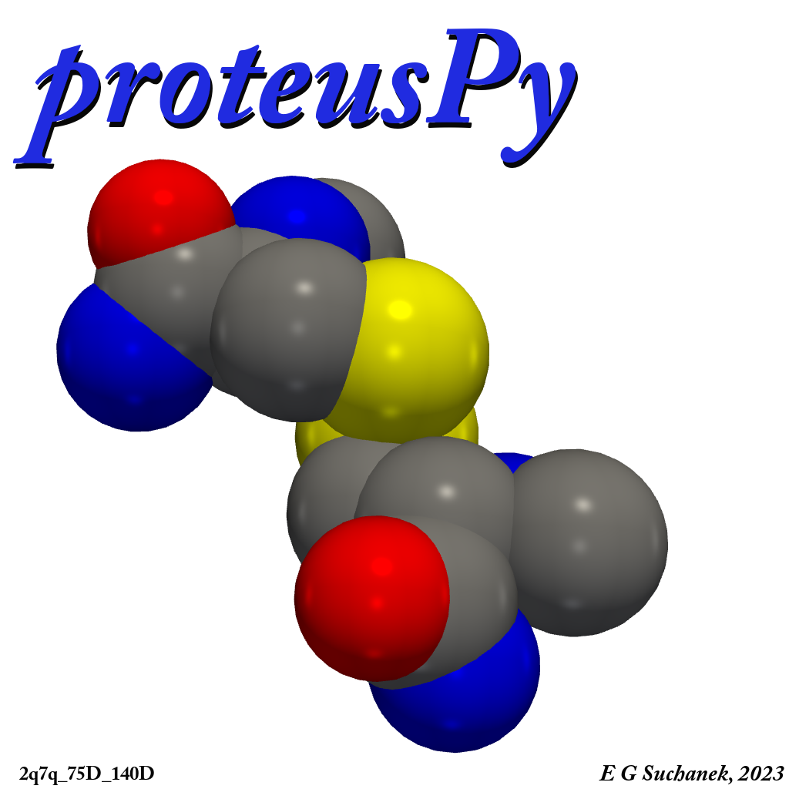

# ChangeLog

Notable changes to the ``proteusPy`` project will be documented in this file.

The format is based on [Keep a Changelog](https://keepachangelog.com/en/1.0.0/),
and this project adheres to [Semantic Versioning](https://semver.org/spec/v2.0.0.html).

## [Unreleased]

### Added

- **Pepys benchmark enriched embeddings** (`pepys_embeddings.json`) — precomputed nomic-embed-text-4k embeddings for the full Pepys diary corpus, cached for reproducible benchmark runs.
- **Pepys benchmark results** (`pepys_manifold_results.json`) — manifold flight metrics (MRL retrieval, ManifoldWalker path, observer heights/curvatures) from the enriched-corpus run.
- **5 new Pepys query topics** — Church/religion, Travel/locations, Money/finance, Social gathering, and Emotion/personal feelings added to `PEPYS_QUERIES` for broader semantic coverage of the diary corpus.
- **`_NumpyEncoder`** in `pepys_manifold_explorer.py` — custom `json.JSONEncoder` subclass that serialises numpy scalar and array types, preventing `TypeError` when saving results that include numpy integers/floats.

### Changed

- **`pepys_manifold_explorer.py` — enriched embedding format**: `parse_diary()` now prepends `entry_type | category |` to each diary entry before embedding, so topic-level signal from `pepys_enriched_full.txt` is preserved in the embedding space. Comment lines (`#`) and blank lines are now silently skipped.
- **`ManifoldModel` constructor** — `n_neighbors` parameter renamed to `k_graph` in all benchmark call-sites (`nomic_manifold_explorer.py`, `pepys_manifold_explorer.py`).
- **`ManifoldModel.set_position()`** → **`ManifoldModel.fly_to()`** — updated `pepys_manifold_explorer.py` to use the renamed positioning method.
- **`ManifoldObserver` constructor** — simplified from `ManifoldObserver(mm._graph, mm._geometries)` to `ManifoldObserver(mm)` in `pepys_manifold_explorer.py`.
- **Observer path API** — `flight_obs["mean_height"]` / `flight_obs["mean_curvature"]` replaced by averaging over raw `flight_obs["heights"]` / `flight_obs["curvatures"]` lists, matching the updated `observe_path()` return schema.
- **Code formatting** (`nomic_manifold_explorer.py`, `pepys_manifold_explorer.py`) — Black-style line-length fixes throughout; no logic changes.

- **`ManifoldObserver.observe_path()`** — "pen-down view from above": given a walker's traced node path, the observer measures per-hop height (reconstruction error from the local tangent plane) and curvature (principal angle between consecutive tangent subspaces), returning a structured dict that summarises the full trajectory from one dimension above.
- **`disulfide_manifold_flight.py`** benchmark — canonical end-to-end demonstration of manifold flight through the 5D disulfide torsional space (χ₁–χ₅) using the full proteusPy database (175 277 bonds). Selects the two most-distant **octant-class** centroids as origin and destination (the finest-grained, most distant landmarks in the hierarchy), flies the graph with `ManifoldWalker`, records per-hop class membership at all four hierarchy levels (binary/quadrant/sextant/octant), and feeds the path to `ManifoldObserver.observe_path()`.
- **`disulfide_flight_visualizer.py`** — post-run visualisation: trajectory plots, curvature/height profiles, class-boundary crossing charts.
- **`disulfide_flight_results.json` / `.png` / `_report.md`** — artefacts from the first full-database flight run (k=20, τ=0.9, w=0.8, 200-step budget, 992 s elapsed).
- **`mlp_expand_first.py`** benchmark — "expand-first" MLP architecture comparison baseline against `ManifoldModel` on structured biological data.
- **`nomic_manifold_explorer.py`** benchmark — intrinsic dimensionality analysis of nomic-embed-text-v1 embeddings (PCA elbow, Participation Ratio, TwoNN estimator) at all MRL checkpoints (64–768 D) with MRR@10 retrieval quality comparison.
- **WaveRider arXiv manuscript** (`docs/waverider/waverider_arxiv.tex` / `.pdf` / `_draft.md`) — full paper describing the four-layer WaveRider geometric ML stack: TurtleND → ManifoldWalker → ManifoldModel/ManifoldObserver.

### Changed

- **`ManifoldModel.fly_toward()`** — added `patience` parameter (default 5). With sparse graphs a greedy step can move sideways; `patience` lets the walker continue past brief non-improving detours rather than terminating at the first stall.
- **`pyproject.toml`** — extended pytest `--ignore` list to cover `turtlend_package/` so its tests do not run in the main test suite.
- **`.gitignore`** — added `proteusPy/data/PDB_SS_ALL_LOADER.pkl` to avoid committing the large binary loader cache.

### Fixed

- Added missing BSD/Flux-Frontiers header blocks to `manifold_observer.py`, `manifold_model.py`, `manifold_walker.py`, `turtleND.py`, and `disulfide_tree.py`.

---

## [v0.99.50] - 2026-03-23

### Overview

This release introduces the complete **WaveRider geometric ML stack** — a four-layer framework for manifold-aware machine learning that operates without learned parameters. The central thesis: *the manifold IS the model*. Real data occupies a low-dimensional manifold embedded in a high-dimensional ambient space (71–99% of dimensions are noise). WaveRider discovers that manifold, navigates it, classifies within it, and — with the new ManifoldObserver — sees its global topology from one dimension above.

### Added

- **`ManifoldObserver`** (Layer 3a) — An (N+1)-dimensional geometric observer that hovers above the N-dimensional data manifold. By extending the subject TurtleND's orthonormal frame by one dimension via QR, the observer gains the manifold normal — a literal vantage point above the surface. From there it can measure curvature (principal angles between neighboring tangent subspaces), height fields (reconstruction error from local tangent planes), global topology, and classify points by direct projection rather than graph search. What the ManifoldModel discovers by walking, the ManifoldObserver sees at a glance.
- **`tree_visualizer`** — Visualization utilities for `DisulfideTree`: `text_tree` (ASCII), `png_tree` (matplotlib), `tree_3d` (interactive PyVista). All three exported from the top-level namespace.
- **`ManifoldModel`** (Layer 3) — Zero-parameter geometric classifier. Builds a manifold-weighted knowledge graph via local PCA (SVD), classifies via graph-walk + tangent-space voting. No learned weights; the graph, local bases, and eigenvalue field *are* the model.
- **`ManifoldWalker` / `ManifoldAdamWalker`** (Layer 2) — Riemannian-approximate gradient descent. Each step: KNN → local PCA → project gradient onto tangent plane → eigenvalue-weighted step. Adam variant replaces eigenvalue weighting with momentum + adaptive LR in global coordinates so momentum survives frame reorientations.
- **`TurtleND`** (Layer 1) — N-dimensional generalization of Turtle3D. Carries position **p** ∈ ℝᴺ and an N×N orthonormal frame. All rotations are Givens rotations; QR re-orthonormalization prevents frame drift.
- **`graph_reasoner`** — `KnowledgeGraph`, `SemanticEdge`, and steering strategies (`GradientSteering`, `TargetSteering`, `ExplorationSteering`) underpinning ManifoldModel navigation.
- **WaveRider documentation** — `docs/waverider/waverider_stack_summary.md` (algorithmic reference for all four layers) and `docs/manifold_observer/manifold_observer.md` (mathematical treatment of the extrinsic observer construction).
- **CIFAR-10, Iris, MNIST, Digits benchmarks** with TensorBoard logging. CIFAR-10: `PCA→30D + ManifoldModel (τ=0.85)` achieves 32.5% accuracy with zero learned parameters.
- **KGRAG integration** — CodeKG, DocKG, FileTreeKG indices built and snapshotted at this version (22,575 code nodes / 87.7% docstring coverage; 2,315 doc nodes / 96.6% semantic coverage).

### Changed

- Migrated build backend from `setuptools` to `poetry-core>=2.0.0`.
- `tensorflow-metal` moved to optional `[metal]` extra.
- `pyvista >=0.44.0` with `extras = ["jupyter"]`; `trame-vtk >=2.0.0` replaces `trame-jupyter-extension`.
- `doc-kg`, `code-kg` as native Poetry git deps; `ftree-kg` as local path editable dep.
- CI updated to `poetry install --with dev`, `actions/checkout@v4`, `setup-python@v5`; now also triggers on pull requests.
- Ruff enforced across `proteusPy/`, `benchmarks/`, `tests/`, `turtlend_package/`; zero violations.
- `Optional[X]` modernised to `X | None` throughout the new ML stack.

### Fixed

- Removed unused `DATA_DIR` import in `DisulfideExtractor_mp.py`.
- Fixed `"pandas.DataFrame"` string annotation in `DisulfideVisualization.py`.
- Renamed ambiguous `l` → `left_vec` / `v` in `turtleND.py` and architecture benchmarks.
- Removed unused local variables across `DisulfideLoader`, `disulfide_tree`, `manifold_observer`, `tree_visualizer`.

## [v0.99.40] - 2026-03-23

### Changed

- Ruff linting extended to `benchmarks/`, `tests/`, and `turtlend_package/`; all directories now clean.
- `turtlend_package/src/` synced with current `proteusPy/` sources (`turtleND`, `manifold_model`, `manifold_walker`, `turtle3D`).
- `turtlend_package/benchmarks/` synced with latest benchmark scripts including TBLogger, plotting, and metal-detection fixes.
- `turtlend_package/benchmarks/results/cifar10_manifold_model_results.json` updated with latest run.
- `turtlend_package/tests/` synced with corrected basis-shape assertions.
- Ruff `[tool.ruff.lint.per-file-ignores]` extended to cover `benchmarks/*.py` and `turtlend_package/` for intentional E402 bootstrap patterns and F401 re-exports.

### Fixed

- E741 ambiguous variable `l` in list comprehensions in `cifar10_manifold_architecture.py` and `mnist_manifold_architecture.py` → renamed to `v`.
- Removed stale `turtlend_package.tar.gz` binary from repo.

## [v0.99.40] - 2026-03-23 (initial)

### Added

- `ManifoldModel` — zero-parameter geometric classifier using local PCA, manifold-weighted knowledge graphs, and graph-walk voting for classification. Supports fly-mode manifold navigation.
- `TurtleND` — N-dimensional turtle for manifold traversal, underpinning `ManifoldModel` navigation.
- `ManifoldWalker` — manifold-aware graph traversal and path-finding.
- `graph_reasoner.py` — `KnowledgeGraph` and `SemanticEdge` primitives used by `ManifoldModel`.
- CIFAR-10 and Iris benchmarks for `ManifoldModel` vs. Euclidean KNN across PCA dimensionalities and tau values, with TensorBoard logging to `runs/`.
- Full KGRAG integration: CodeKG, DocKG, and FileTreeKG indices built and snapshotted at v0.99.40 (baseline: 22,575 code nodes / 87.7% coverage, 2,315 doc nodes / 96.6% coverage, 465 file-tree nodes).
- `[tool.codekg]`, `[tool.dockg]` configuration sections in `pyproject.toml`.

### Changed

- Migrated build backend from `setuptools` to `poetry-core>=2.0.0`; all metadata moved to `[tool.poetry]`.
- `doc-kg` and `code-kg` declared as native Poetry git dependencies; `ftree-kg` as local path editable dep.
- `tensorflow-metal` moved to optional `[metal]` extra to unblock cross-platform installs.
- `pyvista` aligned with `code_kg` reference: `>=0.44.0` with `extras = ["jupyter"]`; `trame-jupyter-extension` replaced by `trame-vtk = ">=2.0.0"`.
- `param`, `plotly` version pins relaxed to `>=` constraints matching `code_kg`.
- Optional extras reorganised: `viz3d`, `kg`, `metal`, `all`; dev deps aligned with `code_kg` (`ruff`, `mypy`, `pre-commit`, `detect-secrets`, `pylint`).
- `Optional[X]` type annotations modernised to `X | None` throughout `ManifoldModel`.
- Ruff linting configured (`[tool.ruff]`) and codebase cleaned to zero violations.

### Fixed

- Removed unused `DATA_DIR` import in `DisulfideExtractor_mp.py` (shadowed by local redefinition).
- Fixed `"pandas.DataFrame"` string annotation → `"pd.DataFrame"` in `DisulfideVisualization.py`.
- Renamed ambiguous variable `l` → `left_vec` in `turtleND.py`.
- Removed unused local variables (`res`, `sg_cutoff`, `ca_cutoff`, `child_base`) across `DisulfideLoader`, `disulfide_tree`.
- Trailing whitespace and percent-format style issues cleaned across multiple modules.

## [v0.99.35] - 2025-4-26

### Added

- ``DisulfideEnergy`` class to decompose the disulfide torsional strain calculations using the standard calculation and also the equation used by Hogg et al. in their Allosteric Disulfide Bond paper. @TODO refactor ``Disulfide`` to use this class rather than the currently built-in energy functions.
- Moved several notebooks into the **examples/** directory.
-

### Changed

- Added ``rich`` text formatting to the logging functions, yielding more attractive log messages.
- Cleaned up the global logging/file handling in ``logger_config.py``.
- Enhanced the ``DisulfideLoader.summary()`` function for readability.

### Fixed

- Low level bug with global logger which caused duplicate log messages.
- Turned on translation to center of mass for visualization to center each disulfide.

### Issues

- ``Disulfide.spin()`` only works under MacOS. Throws a plotter error under Windows.
-

## [v0.99.34] - 2025-04-02

### Added

- statistical calculations for classes in DisulfideClass_Analysis.py, writes the .pkl to the appropriate dir. The .csv metrics file is saved under $PDB/data.
- ``DisulfideClassGenerator.py``. This new class manages all aspects of the generation
  of disulfide structures that represent the overall envelope of structures accessible
  to a given structural class consensus disulfide. For instance, if a binary class
  (00000b) has a consensus structure of chi1-chi5 +/- five degrees it can generate the
  243, (3^5) structures and calculate statistics for this 'tree'.
- ``display_class_disufides`` entrypoint added. This utilizes the new class to display a given
  disulfide class in a separate window using the ``DisulfideList.display_overlay()`` function.
- ``hexbin_plot`` entrypoint added. This program creates 3D interactive plots showing dihedral angle correlations between left-handed and right-handed disulfides.
- ``proteusPy.DisulfideBase.Disulfide.TorsionEnergyKJ`` property and calculation to use Hogg's DSE potential function.
- Enhanced ``DisulfideLoader`` to accept a percentile cutoff. This then calculates proper Ca and Sg distance cutoffs and applies them to the master disulfide list upon instantiation. This obviates the need for explicit Ca and Sg cutoffs.

### Changed

- ``DisulfideClass_Analysis.py`` now creates the binary and octant torsion metrics
  files needed for the new ``DisulfideClassGenerator`` class. These are needed upon
  class instantiation and are bundled into the package. Note that the octant class
  metrics file will be dependent on the overall cutoff used during the program run.
  I typically use 0.04, which generates 329 overall consensus structures.
- Removed explicit ca and sg cutoffs from ``DisulfideLoader.Load_PDB_SS()``. Now
  it uses percentile only.

### Fixed

- class string calculation was flipped.
- ``DisulfideLoader`` cutoff values weren't propagating properly
- continued catching small bugs

## [v0.99.33] - 2025-03-05

### Fixed

- a few small issues with testing under Linux
- Makefile tweaks

## [v0.99.32] - 2025-03-05

### Added

- disulfide_schematic.py which has two functions for creating schematic
drawings of Disulfides in various styles:
  - ``create_disulfide_schematics()``
  - ``create_disulfide_schematic_from_model()``
  - test function in the tests/ directory
  - script endpoint: proteusPy.create_disulfide_schematics

### Fixed

- Finished refactoring for ``DisulfideIO.py``
- Corrected parameter order in ``DisulfideBase.DisulfideList.display_overlay()``
- Corrected the ``.screenshot()`` function to work correctly on Windows.
- Corrected Makefile installation target to install from the wheel, not repo

## [v0.99.31] - 2025-2-23

### Added

- ``DisulfideList.Average_Sg_Distance`` property
- Disulfide List info added to the ``rcsb_viewer.py`` info pane

### Fixed

- ``rcsb_viewer.py`` - refactored for new ``DisulfideVisualization`` classes.
- Pushed to both DockerHub and GitHub repositories.
-

## [v0.99.3] - 2024-2-22

### Added

- Stronger type checking across many functions
- Additional error checking for slicing lists
- Several new Unittests

### Changed

- Refactored both ``Disufulfide`` and ``DisulfideList`` and moved plotting and statistics into new classes ``DisulfideVisualization`` and ``DisulfideStats``.
- Simplification and unification of accessing Disulfides via class strings
- Generalized Disulfide class creation, can create up to 26-fold classes now.

### Fixed

- DisulfideList.AverageConformation now uses a circular mean function to correctly handle the nature of -180 - 180 degree dihedral angle averaging.

## [v0.99.1.dev0] - 2024-2-07 unreleased

### Added

- Disulfide.spin() - Spin the disulfide about the Y axis.
- Test_DisplaySS.py - Unittest improvements.

### Changed

- Completely rewrote ``DisulfideClass_Constructor`` methods that generate the binary and octant class strings for simplicity.
- The new ``DisulfideClass_Constructor.get_segment()`` is a more general version of ``DisulfideClass_Constructor.get_eighth_quadrant()``.

## [v0.98.5] - 2024-1-23

### Added

- static method ``DisufideClass_Constructor.class_string_from_dihedral()`` - return the binary or octant class string for a single or array of dihedrals.
- properties ``Disulfide.binary_class_string`` and ``Disulfide.octant_class_string``
- ``DisulfideLoader.sslist_from_class()`` - now uses the index value for a specific disulfide that matches the classID from the TorsionDF dataframe. This allows for direct access to the DisulfideList containing the Disulfides via ``loader[index]``, which is significantly faster than looking up via ``loader[disulfide_name]``.

### Changed

- vectorized binary and octant class string construction
- added binary and octant class strings to the master ``loader.TorsionDF`` DataFrame.
- Rewrote ``programs/DisulfideClass_Extractor.py`` to use the index-based address scheme described above. This resulted in about a 20x speedup in the program!

## [v0.98.4] - 2024-1-17

### Added

- ``DisulfideList.plot_distances()``
- ``DisulfideList.plot_deviation_histograms()``
- Added the ability to access disulfide class strings directly through ``DisulfideLoader`` with indexing.

### Changed

- ``Load_PDB_SS(verbose=True)`` now calls ``loader.describe()`` to print statistics for the database
- Optimized ``DisulfideList.create_deviation_dataframe()``.
- Moved various class plotting routines into ``DisulfideLoader`` class.
- Cleaned up ``DisulfideClasses.py``

## [v0.98.3] - 2024-1-12

### Added

- ``DisulfideExtractor_mp.py`` moved into the package as a callable module.

  ``proteusPy.DisulfideExtractor`` from command line will launch the program

- Incorporated consensus structures into the ``DisulfideClass_Constructor`` object. This presumes these have been generated. The consensus structures are created through the program ``DisulfideClass_Analysis.py``.

### Changed

- Corrected an error in ``DisulfideLoader`` that failed to initialize the torsion dataframe properly after filtering.
- Change to setup.py - 2q7q_seqsim.csv was not being included

### Fixed

- Sg_distance was not being calculated with ``Disulfide.build_yourself()``
- phi and psi were not correctly populating in the torsion dataframe.
- There was a subtle error in the ``DisulfideLoader`` initialization that led to internal database inconsistencies after filtering. This has been corrected.

## [v0.98.2] - 2024-12-30

### Added

- ``qt5viewer.py`` moved into the package as a callable module.

``proteusPy.qt5viewer`` from command line will launch the program

### Changed

- logging cleanup in ``DisulfideLoader.py`` and ``DisulfideList.py``.
- ongoing documentation tweaks, cleanup

## [v0.98.1] - 2024-12-30

### Added

- qt5viewer.py moved into the package as a callable module

``proteusPy.qt5viewer`` from command line will launch the program

### Changed

- moved to Python 3.12

## [v0.98] - 2024-12-24

### Added

- Dynamic resolution for the rcsb_viewer List view.

### Changed

- ``DisulfideList`` code optimization

## [V0.97.17] - 2024-11-30

### Added

- Additional work on rcsb_viewer.py
- Automation scripts for Docker builds

## [V0.97.16] - 2024-11-22

### Added

- One can now access a disulfide by name directly from the loader with:

  ```
    pdb = Load_PDB_SS()
    ss = pdb["2q7q_75D_140D"]
  ```

  In prior versions one would need to use the loader.get_by_name() function.

### Removed

- Removed the ``programs/rcsb_viewer.py`` program. The viewer now lives only in the ``viewer`` directory and can be invoked directly from the command line with:

```console
$panel serve ~/repos/proteusPy/viewer/rcsb_viewer.py --show
```

## [V0.97.15] - 2024-11-10

### Added

- Unified the disulfide viewers such that the rcsb_viewer.py program will work either stand-alone or in Docker.
- Added workflows to build the Docker images on GitHub and Docker Hub
- Made pyqt5 an optional install, pip install proteusPy[pyqt5] adds it back.

## [V0.97.11]

### Added

- Renderers:
  - Docker image for the pyVista renderer. This lives under proteusPy/viewer and is deployed on Docker hub under ``egsuchanek/rcsb_viewer``.
Launch with: ``docker -d -p 5006:5006 egsuchanek/rcsb_viewer:latest. Works under MacOSX and Linux.
  - The standalone Panel-based version lives in ``proteusPy/programs/DBViewer.py``. Launch with: ``panel serve path_to_DBViewer.py --autoreload &``
  - PyQt5 version. This lives in ``proteusPy/programs/QT5Viewer.py``. It is the most advanced version, but I'm unable to build under Linux. My intent was to deploy this via Docker, but can't get PyQt5 to build currently.

- ``DisulfideList.center_of_mass`` - returns the ``Vector3D`` center of mass for the list.
- ``DisulfideList.translate()`` - adds the input ``Vector3D`` object from the list, destructively modifying the coordinates. Used primarily in rendering functions to center the list at ``Vector3D([0,0,0])``.
- ``Disulfide.translate()`` - translates the input Disulfide by the input ``Vector3D``.

### Issues

- I cannot get the QT5 viewer to build under linux. The pyQt5 library won't install.

## [V0.97.10]

### Added

- Disulfide QT5 viewer development, improvement
- ``DisulfideList.display()`` added to provide a summary of the input DisulfideList
- Additional analytics

### Fixed

- Analysis of the PDB entry files revealed yet another parsing issue. There are many structures that contain disulfides referring to themselves, ie 25A-25A. These had not been caught in any prior release and were revealed while I was working on the filtering code.

## [v0.97.9] - 2024-10-07

### Added

Created a Disulfide viewer using pyQt5 library. This program is under programs/viewer.py. It's basic, but provides an easy way to visualize disulfides within the database. The single checkbox toggles between individual disulfide, or overlaid. The latter shows all of the disulfides for the given protein entry, overlaid onto a common coordinate system. I continue to tweak the code, but the core is stable.

## [v0.97.8] - 2024-09-16

### Added

There have been many internal changes to the package since the official release. I list the most relevant below:

- Completely re-wrote the PDB parser, removing the dependency on my Biopython fork. This has led to great improvements in the overall Disulfide extraction process.
- Implemented multi-processing for the Disulfide_Extractor program. It's possible to extract disulfides from over 37,000 PDB files in under 3 minutes on my 2024 M3 Max MacBook Pro, using 14 cores. This process initially took over 1.5 hours!
- Implemented Octant (8-fold) class construction.
- Implemented bond angle and bond distance ideality calculations in order to intelligently extract high-quality disulfides from the database.
- Implemented dynamic DisulfideLoader creation from the master SS list extracted by the DisulfideExtractor.py program.

### Deprecated

- All Biopython references will be ultimately removed.

## [v0.96.31] - 2024-08-06

### Added

- Bump release of ProteusPy with core functionalities corresponding to JOSS paper.
- Publication of JOSS paper

## [v0.96.3] - 2024-07-18

### Added

- Initial release of ProteusPy with core functionalities.
