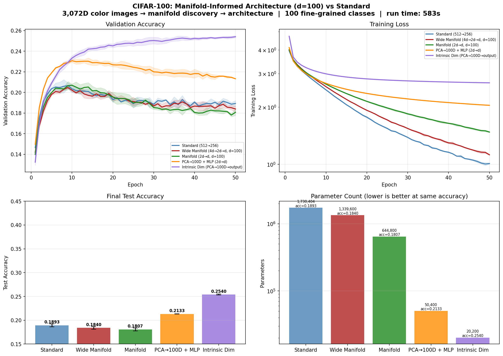

# Manifold-Informed Architecture Benchmark — CIFAR100

**Generated:** 2026-03-29 00:35:26  
**Machine:** Apple M5 Max MacBook Pro, 64 GB RAM, 2TB SSD  
**Repository:** proteusPy @ `d75f66ee` (--abbrev-re
d75f66ee23710c2532ea5fe46bd3588c95e40517)  
**Commit:** 2026-03-29 00:28:46 -0400 — add: unified test structure, outputs  
**Python:** 3.12.13  |  **TensorFlow:** 2.16.2  |  **Device:** CPU  
**Host:** Turing  |  **OS:** macOS-26.4-arm64-arm-64bit

---

## Experimental Setup

| Parameter | Value |
|---|---|
| Dataset | CIFAR100 |
| Input dimensionality | 3,072 |
| Classes | 100 |
| Intrinsic dim (d) | 34 |
| Variance threshold (τ) | 0.9 |
| Epochs | 50 |
| Trials | 3 |

## Manifold Discovery

Local PCA over the training set, k=not recorded neighbors.

| τ | Mean d | Std | Min | Max | Noise % |
|---|---|---|---|---|---|
| 0.95 | 34.5 | 2.3 | 26 | 38 | 98.9% |
| 0.90 | 27.1 | 2.4 | 19 | 31 | 99.1% |
| 0.85 | 22.0 | 2.3 | 14 | 26 | 99.3% |
| 0.80 | 18.1 | 2.2 | 11 | 22 | 99.4% |

### Per-Class Intrinsic Dimensionality

*Showing 10 hardest + 10 easiest classes (sorted by mean d)*

| Class | Mean d | Std | Min | Max |
|---|---|---|---|---|
| tiger | 32.3 | 0.6 | 31 | 33 |
| snake | 32.2 | 0.6 | 31 | 33 |
| motorcycle | 32.1 | 1.0 | 30 | 33 |
| streetcar | 31.7 | 0.8 | 30 | 33 |
| mushroom | 31.6 | 1.4 | 29 | 33 |
| butterfly | 31.2 | 2.8 | 26 | 34 |
| bus | 31.1 | 0.9 | 29 | 32 |
| tractor | 31.0 | 1.0 | 30 | 32 |
| raccoon | 30.8 | 1.9 | 28 | 33 |
| fox | 30.7 | 1.0 | 29 | 32 |
| … | … | … | … | … |
| cockroach | 22.3 | 1.7 | 19 | 25 |
| cup | 22.3 | 1.1 | 20 | 24 |
| plate | 22.1 | 1.1 | 20 | 24 |
| shark | 21.6 | 0.7 | 20 | 22 |
| ray | 21.4 | 1.5 | 19 | 24 |
| bottle | 21.1 | 1.6 | 19 | 23 |
| rocket | 21.0 | 1.3 | 19 | 23 |
| cloud | 19.5 | 1.0 | 18 | 21 |
| plain | 17.2 | 1.7 | 13 | 19 |
| sea | 16.3 | 0.9 | 15 | 18 |

## Architecture Comparison

| Architecture | Params | Test Acc (mean ± std) | Test Loss | Acc/Kparam |
|---|---|---|---|---|
| Standard (512→256) | 1,730,404 | 0.1893 ± 0.0028 | 9.0235 | 0.0001 |
| Wide Manifold (4d→2d→d, d=100) | 1,339,600 | 0.1840 ± 0.0028 | 7.7288 | 0.0001 |
| Manifold (2d→d, d=100) | 644,800 | 0.1807 ± 0.0031 | 6.7401 | 0.0003 |
| PCA→100D + MLP (2d→d) | 50,400 | 0.2133 ± 0.0000 | 4.2884 | 0.0042 |
| Intrinsic Dim (PCA→100D→output) ✦ | 20,200 | 0.2540 ± 0.0010 | 3.2362 | 0.0126 |

## Key Findings

- **Best architecture:** Intrinsic Dim (PCA→100D→output)
  — test accuracy 0.2540 ± 0.0010
- **vs Standard:** +0.0648 (6.48 pp) accuracy gain
- **Parameter reduction:** 85.7× fewer parameters (20,200 vs 1,730,404)
- **Parameter efficiency:** 0.0126 acc/Kparam vs 0.0001 for Standard (115.0× improvement)
- **Manifold compression:** 3,072D → 34D (98.9% of ambient dimensions are noise)

## Result Figure

