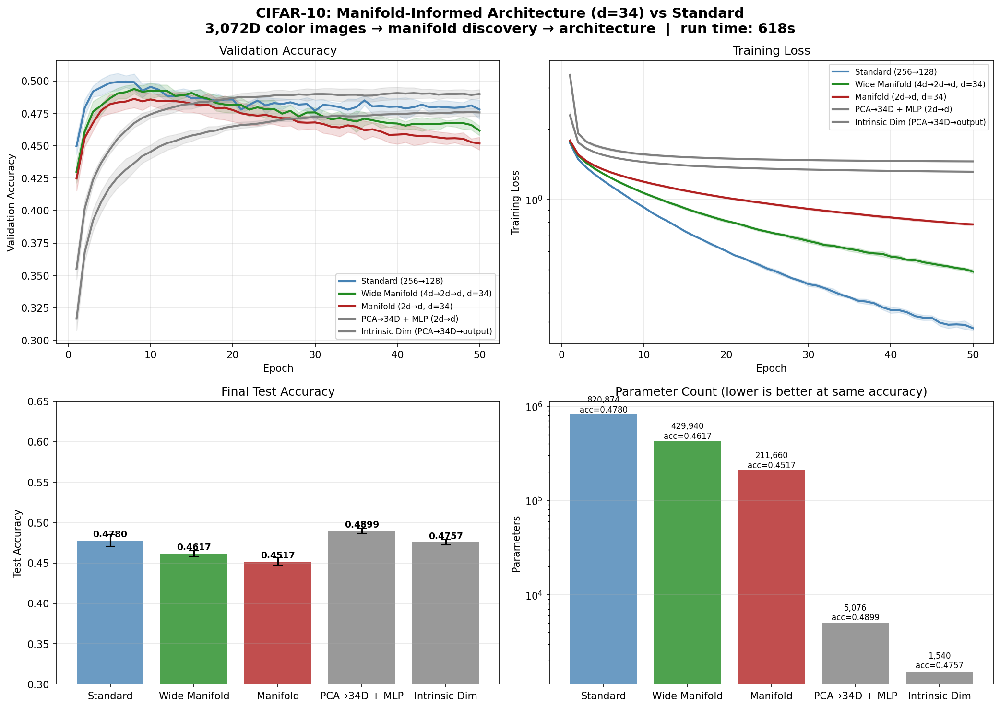

# Manifold-Informed Architecture Benchmark — CIFAR10

**Generated:** 2026-03-29 00:35:25  
**Machine:** Apple M5 Max MacBook Pro, 64 GB RAM, 2TB SSD  
**Repository:** proteusPy @ `d75f66ee` (--abbrev-re
d75f66ee23710c2532ea5fe46bd3588c95e40517)  
**Commit:** 2026-03-29 00:28:46 -0400 — add: unified test structure, outputs  
**Python:** 3.12.13  |  **TensorFlow:** 2.16.2  |  **Device:** CPU  
**Host:** Turing  |  **OS:** macOS-26.4-arm64-arm-64bit

---

## Experimental Setup

| Parameter | Value |
|---|---|
| Dataset | CIFAR10 |
| Input dimensionality | 3,072 |
| Classes | 10 |
| Intrinsic dim (d) | 34 |
| Variance threshold (τ) | 0.9 |
| Epochs | 50 |
| Trials | 5 |

## Manifold Discovery

Local PCA over the training set, k=not recorded neighbors.

| τ | Mean d | Std | Min | Max | Noise % |
|---|---|---|---|---|---|
| 0.95 | 36.1 | 1.8 | 29 | 40 | 98.8% |
| 0.90 | 29.0 | 1.9 | 22 | 33 | 99.1% |
| 0.85 | 23.8 | 1.9 | 17 | 28 | 99.2% |
| 0.80 | 19.8 | 1.8 | 13 | 24 | 99.4% |

### Per-Class Intrinsic Dimensionality

| Class | Mean d | Std | Min | Max |
|---|---|---|---|---|
| frog | 31.7 | 1.5 | 28 | 34 |
| truck | 31.6 | 1.3 | 28 | 34 |
| automobile | 31.6 | 1.4 | 25 | 33 |
| horse | 30.6 | 1.1 | 28 | 33 |
| deer | 29.0 | 1.1 | 26 | 31 |
| bird | 28.7 | 2.0 | 24 | 32 |
| cat | 28.5 | 1.0 | 26 | 30 |
| dog | 28.3 | 0.8 | 27 | 30 |
| airplane | 26.1 | 1.7 | 22 | 29 |
| ship | 25.6 | 2.1 | 21 | 29 |

## Architecture Comparison

| Architecture | Params | Test Acc (mean ± std) | Test Loss | Acc/Kparam |
|---|---|---|---|---|
| Standard (256→128) | 820,874 | 0.4780 ± 0.0074 | 4.0688 | 0.0006 |
| Wide Manifold (4d→2d→d, d=34) | 429,940 | 0.4617 ± 0.0037 | 2.9960 | 0.0011 |
| Manifold (2d→d, d=34) | 211,660 | 0.4517 ± 0.0049 | 2.2602 | 0.0021 |
| PCA→34D + MLP (2d→d) ✦ | 5,076 | 0.4899 ± 0.0034 | 1.4557 | 0.0965 |
| Intrinsic Dim (PCA→34D→output) | 1,540 | 0.4757 ± 0.0033 | 1.4732 | 0.3089 |

## Key Findings

- **Best architecture:** PCA→34D + MLP (2d→d)
  — test accuracy 0.4899 ± 0.0034
- **vs Standard:** +0.0119 (1.19 pp) accuracy gain
- **Parameter reduction:** 161.7× fewer parameters (5,076 vs 820,874)
- **Parameter efficiency:** 0.0965 acc/Kparam vs 0.0006 for Standard (165.8× improvement)
- **Manifold compression:** 3,072D → 34D (98.9% of ambient dimensions are noise)

## Result Figure

