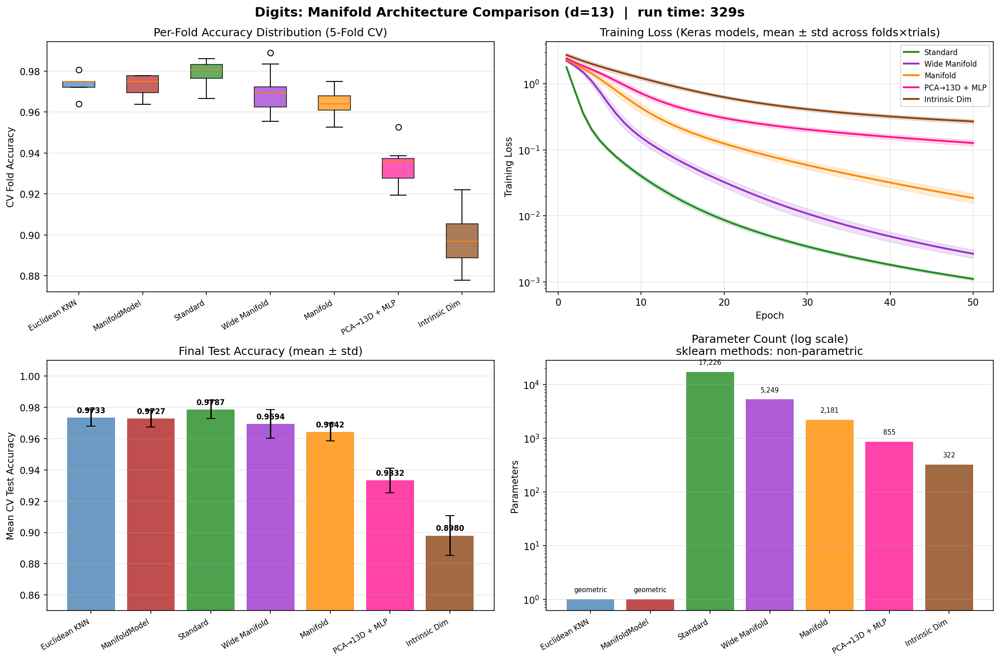

# Manifold-Informed Architecture Benchmark — DIGITS

**Generated:** 2026-03-29 00:35:26  
**Machine:** Apple M5 Max MacBook Pro, 64 GB RAM, 2TB SSD  
**Repository:** proteusPy @ `d75f66ee` (--abbrev-re
d75f66ee23710c2532ea5fe46bd3588c95e40517)  
**Commit:** 2026-03-29 00:28:46 -0400 — add: unified test structure, outputs  
**Python:** 3.12.13  |  **TensorFlow:** 2.16.2  |  **Device:** CPU  
**Host:** Turing  |  **OS:** macOS-26.4-arm64-arm-64bit

---

## Experimental Setup

| Parameter | Value |
|---|---|
| Dataset | DIGITS |
| Input dimensionality | 64 |
| Classes | 10 |
| Intrinsic dim (d) | 13 |
| Variance threshold (τ) | 0.9 |
| Epochs | 50 |
| Trials | 3 |
| Batch size | 64 |
| Learning rate | 0.001 |

## Manifold Discovery

Local PCA over the training set, k=30 neighbors.

| τ | Mean d | Std | Min | Max | Noise % |
|---|---|---|---|---|---|
| 0.95 | 14.4 | 1.8 | 8 | 18 | 77.5% |
| 0.90 | 10.9 | 1.7 | 5 | 14 | 82.9% |
| 0.85 | 8.8 | 1.6 | 4 | 12 | 86.3% |
| 0.80 | 7.3 | 1.4 | 3 | 10 | 88.5% |

### Per-Class Intrinsic Dimensionality

| Class | Mean d | Std | Min | Max |
|---|---|---|---|---|
| Digit 0 | 12.4 | 0.6 | 11 | 13 |
| Digit 8 | 12.3 | 1.1 | 7 | 13 |
| Digit 9 | 11.8 | 0.6 | 10 | 13 |
| Digit 5 | 11.6 | 0.8 | 10 | 13 |
| Digit 3 | 11.5 | 0.8 | 9 | 13 |
| Digit 6 | 10.6 | 1.5 | 4 | 12 |
| Digit 2 | 10.3 | 0.7 | 9 | 11 |
| Digit 7 | 10.2 | 1.2 | 6 | 11 |
| Digit 4 | 9.5 | 1.2 | 5 | 11 |
| Digit 1 | 8.9 | 1.8 | 5 | 11 |

## Architecture Comparison

| Architecture | Params | Test Acc (mean ± std) | Test Loss | Acc/Kparam |
|---|---|---|---|---|
| Euclidean KNN (k=7) | 0 | 0.9733 ± 0.0054 | N/A | N/A |
| ManifoldModel (τ=0.9) | 0 | 0.9727 ± 0.0054 | N/A | N/A |
| Standard (128→64) | 17,226 | 0.9787 ± 0.0059 | 0.0930 | 0.0568 |
| Wide Manifold (4d→2d→d, d=13) | 5,249 | 0.9694 ± 0.0091 | 0.1291 | 0.1847 |
| Manifold (2d→d, d=13) | 2,181 | 0.9642 ± 0.0058 | 0.1305 | 0.4421 |
| PCA→13D + MLP (2d→d) | 855 | 0.9332 ± 0.0078 | 0.2184 | 1.0915 |
| Intrinsic Dim (PCA→13D→output) | 322 | 0.8980 ± 0.0127 | 0.3242 | 2.7888 |

## Key Findings

- **Best architecture:** Standard (128→64)
  — test accuracy 0.9787 ± 0.0059
- **Manifold compression:** 64D → 13D (79.7% of ambient dimensions are noise)

## Result Figure

