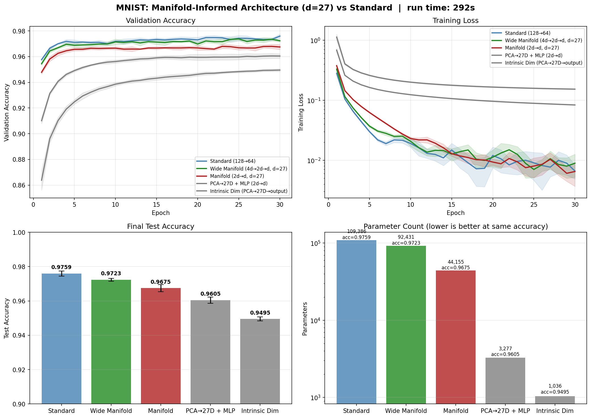

# Manifold-Informed Architecture Benchmark — MNIST

**Generated:** 2026-03-29 00:35:25  
**Machine:** Apple M5 Max MacBook Pro, 64 GB RAM, 2TB SSD  
**Repository:** proteusPy @ `d75f66ee` (--abbrev-re
d75f66ee23710c2532ea5fe46bd3588c95e40517)  
**Commit:** 2026-03-29 00:28:46 -0400 — add: unified test structure, outputs  
**Python:** 3.12.13  |  **TensorFlow:** 2.16.2  |  **Device:** CPU  
**Host:** Turing  |  **OS:** macOS-26.4-arm64-arm-64bit

---

## Experimental Setup

| Parameter | Value |
|---|---|
| Dataset | MNIST |
| Input dimensionality | 784 |
| Classes | 10 |
| Intrinsic dim (d) | 27 |
| Variance threshold (τ) | 0.9 |
| Epochs | 30 |
| Trials | 5 |

## Manifold Discovery

Local PCA over the training set, k=not recorded neighbors.

| τ | Mean d | Std | Min | Max | Noise % |
|---|---|---|---|---|---|
| 0.95 | 29.4 | 3.1 | 16 | 34 | 96.2% |
| 0.90 | 21.9 | 2.9 | 9 | 27 | 97.2% |
| 0.85 | 17.2 | 2.6 | 6 | 22 | 97.8% |
| 0.80 | 13.9 | 2.3 | 5 | 18 | 98.2% |

### Per-Class Intrinsic Dimensionality

| Class | Mean d | Std | Min | Max |
|---|---|---|---|---|
| Digit 8 | 24.7 | 1.3 | 19 | 27 |
| Digit 3 | 23.8 | 2.5 | 10 | 26 |
| Digit 5 | 23.7 | 2.6 | 11 | 27 |
| Digit 2 | 23.4 | 3.1 | 11 | 27 |
| Digit 0 | 23.3 | 0.9 | 21 | 25 |
| Digit 4 | 23.0 | 1.6 | 17 | 25 |
| Digit 6 | 20.8 | 2.9 | 8 | 24 |
| Digit 9 | 20.7 | 1.2 | 17 | 23 |
| Digit 7 | 19.7 | 2.6 | 10 | 24 |
| Digit 1 | 16.6 | 2.7 | 1 | 19 |

## Architecture Comparison

| Architecture | Params | Test Acc (mean ± std) | Test Loss | Acc/Kparam |
|---|---|---|---|---|
| Standard (128→64) | 109,386 | 0.9759 ± 0.0015 | 0.2374 | 0.0089 |
| Wide Manifold (4d→2d→d, d=27) | 92,431 | 0.9723 ± 0.0008 | 0.2448 | 0.0105 |
| Manifold (2d→d, d=27) | 44,155 | 0.9675 ± 0.0020 | 0.2855 | 0.0219 |
| PCA→27D + MLP (2d→d) | 3,277 | 0.9605 ± 0.0018 | 0.1356 | 0.2931 |
| Intrinsic Dim (PCA→27D→output) | 1,036 | 0.9495 ± 0.0011 | 0.1692 | 0.9165 |

## Key Findings

- **Best architecture:** Standard (128→64)
  — test accuracy 0.9759 ± 0.0015
- **Manifold compression:** 784D → 27D (96.6% of ambient dimensions are noise)

## Result Figure

