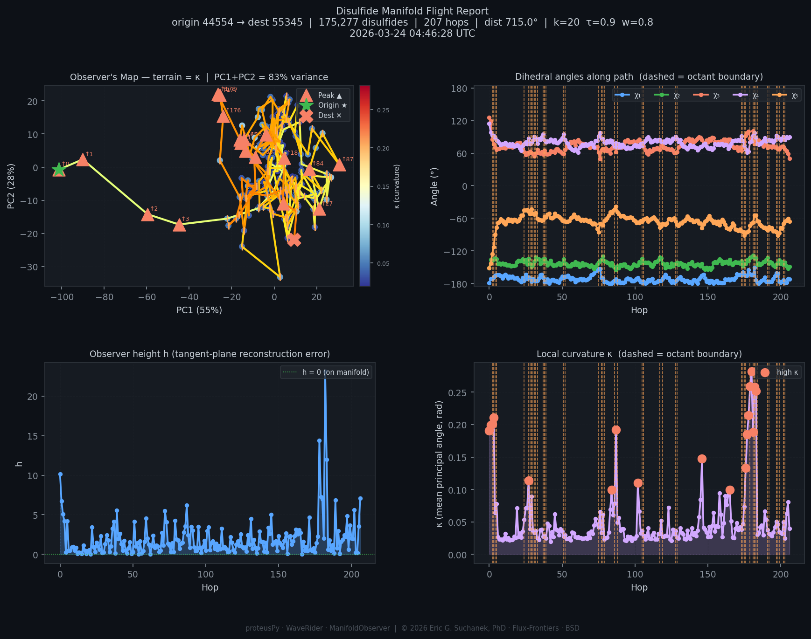

# Disulfide Manifold Flight Report

> **WaveRider · ManifoldWalker demo** — navigating the 5D disulfide torsional manifold
> via the proteusPy structural database.

---

## Provenance

| Field | Value |
|-------|-------|
| Run timestamp (UTC) | `2026-03-24 04:46:28 UTC` |
| Elapsed time | 1028.9 s |
| proteusPy database | full (subset=False) |
| Disulfides loaded | 175,277 |
| Script | `benchmarks/disulfide_manifold_flight.py` |
| Report generated by | WaveRider / ManifoldObserver stack |

---

## Run Parameters

| Parameter | Value | Description |
|-----------|-------|-------------|
| `--n` | all | Disulfides sampled (0 = full DB) |
| `--k` | 20 | KNN for manifold graph construction |
| `--tau` | 0.9 | PCA variance threshold (intrinsic dim) |
| `--w` | 0.8 | Manifold weight in blending function |
| `--patience` | 15 | Non-improving hops before stopping |
| `--max-steps` | 500 | Maximum graph hops |

---

## Class Hierarchy

Disulfide bonds are classified by the sign/sector of each of the five
backbone-independent dihedral angles (χ₁–χ₅) at four levels of refinement:

| Level | Base | Classes (theory) | Classes present |
|-------|------|-----------------|-----------------|
| binary   | 2 | 2⁵ = 32     | 32 |
| quadrant | 4 | 4⁵ = 1,024  | 969 |
| sextant  | 6 | 6⁵ = 7,776  | 4702 |
| octant   | 8 | 8⁵ = 32,768 | 9697 |

Each level *refines* the previous. Octant is the finest grain (45° sectors).
A flight between maximally distant octant centroids must cross all coarser
boundaries along the way.

---

## Flight Summary

| Field | Value |
|-------|-------|
| Origin octant class | `44554` |
| Destination octant class | `55345` |
| Centroid distance | 715.0° (5D Euclidean, torsional) |
| Path length | 207 hops |
| Arrived at destination | ✗ No (stopped early) |
| Mean local intrinsic dim | 4.0 |

### Boundary Crossings

| Level | Crossings | Meaning |
|-------|-----------|---------|
| binary   | 0 | Sign-level transitions (coarsest) |
| quadrant | 26 | 90° sector transitions |
| sextant  | 39 | 60° sector transitions |
| octant   | 45 | 45° sector transitions (finest) |

### Observer (N+1 Dimensional View)

The ManifoldObserver lifts each hop into (N+1)-space. The extra coordinate
is the reconstruction error — how far the node sits above its local tangent plane.

| Metric | Value |
|--------|-------|
| Mean height h | 1.944 |
| Mean curvature κ | 0.0507 |
| High-curvature hops | [0, 1, 2, 3, 27, 84, 87, 102, 146, 165, 176, 177, 178, 179, 180, 181, 182, 183] |

---

## Flight Path

| Hop | Node | d | binary | quadrant | sextant | octant | χ₁ | χ₂ | χ₃ | χ₄ | χ₅ |
|-----|------|---|--------|----------|---------|--------|----|----|----|----|-----|
| 0 | n166648 | 4 | 00220 | 22332 | 33453 | 44664 | -178.7 | -151.4 | 125.9 | 114.4 | -151.3 |
| 1 | n104632 | 4 | 00220 | 22332 | 33553 | 44664 | -170.9 | -136.2 | 118.9 | 98.6 | -142.7 |
| 2 | n81825 | 3 | 00220 | 22432 | 33553 | 44763 | -171.2 | -138.0 | 85.3 | 93.2 | -125.6 |
| 3 | n82403 | 4 | 00220 | 22432 | 33552 | 43763 | -168.8 | -135.0 | 77.0 | 91.8 | -112.7 |
| 4 | n16756 | 4 | 00220 | 22442 | 33552 | 43773 | -165.3 | -133.9 | 70.7 | 88.5 | -90.2 |
| 5 | n12254 | 4 | 00220 | 22441 | 33552 | 44772 | -164.4 | -135.1 | 66.3 | 83.4 | -76.5 |
| 6 | n78018 | 4 | 00220 | 22441 | 33552 | 44772 | -164.3 | -143.5 | 67.9 | 81.8 | -68.6 |
| 7 | n9006 | 4 | 00220 | 22441 | 33552 | 44772 | -164.5 | -142.6 | 68.3 | 78.8 | -66.7 |
| 8 | n60231 | 4 | 00220 | 22441 | 33552 | 44772 | -166.4 | -144.7 | 71.2 | 75.3 | -61.5 |
| 9 | n58134 | 4 | 00220 | 22441 | 33552 | 44772 | -170.1 | -142.7 | 69.6 | 77.2 | -64.0 |
| 10 | n164760 | 4 | 00220 | 22441 | 33552 | 44772 | -165.3 | -144.4 | 74.2 | 76.4 | -68.0 |
| 11 | n102371 | 4 | 00220 | 22441 | 33552 | 44772 | -163.5 | -144.1 | 69.2 | 79.5 | -70.7 |
| 12 | n25861 | 4 | 00220 | 22441 | 33552 | 44772 | -165.9 | -146.8 | 72.1 | 76.2 | -65.7 |
| 13 | n131291 | 4 | 00220 | 22441 | 33552 | 44772 | -170.8 | -146.5 | 73.1 | 74.3 | -61.6 |
| 14 | n9932 | 4 | 00220 | 22441 | 33552 | 44772 | -167.4 | -146.3 | 71.2 | 76.8 | -64.8 |
| 15 | n36218 | 4 | 00220 | 22441 | 33552 | 44772 | -169.0 | -147.9 | 75.1 | 73.1 | -62.5 |
| 16 | n32949 | 4 | 00220 | 22441 | 33552 | 44772 | -166.7 | -147.2 | 70.6 | 76.5 | -65.8 |
| 17 | n23231 | 4 | 00220 | 22441 | 33552 | 44772 | -170.8 | -146.9 | 75.3 | 72.8 | -62.2 |
| 18 | n31352 | 4 | 00220 | 22441 | 33552 | 44772 | -170.1 | -146.3 | 76.1 | 73.3 | -63.1 |
| 19 | n45748 | 4 | 00220 | 22441 | 33552 | 44772 | -169.7 | -140.1 | 78.7 | 74.8 | -65.6 |
| 20 | n43240 | 4 | 00220 | 22441 | 33552 | 44772 | -172.9 | -137.9 | 76.1 | 73.0 | -64.8 |
| 21 | n82753 | 4 | 00220 | 22441 | 33552 | 44772 | -174.5 | -138.5 | 78.9 | 68.7 | -60.5 |
| 22 | n169001 | 4 | 00220 | 22441 | 33551 | 44772 | -177.3 | -138.1 | 76.2 | 64.7 | -54.2 |
| 23 | n104144 | 4 | 00220 | 22441 | 33551 | 44772 | -169.8 | -135.0 | 68.2 | 73.2 | -54.7 |
| 24 | n110340 | 4 | 00220 | 22441 | 33551 | 44771 | -174.3 | -140.6 | 61.9 | 76.8 | -44.7 |
| 25 | n131110 | 4 | 00220 | 22441 | 33651 | 44771 | -163.3 | -135.9 | 57.4 | 80.0 | -45.0 |
| 26 | n51446 | 4 | 00220 | 22441 | 33551 | 44771 | -171.5 | -144.5 | 60.2 | 76.7 | -44.0 |
| 27 | n174297 | 4 | 00220 | 22441 | 33651 | 43772 | -168.9 | -134.4 | 59.2 | 86.7 | -47.5 |
| 28 | n16397 | 4 | 00220 | 22441 | 33551 | 44772 | -170.3 | -144.1 | 63.1 | 76.4 | -52.0 |
| 29 | n36236 | 4 | 00220 | 22441 | 33551 | 44771 | -176.1 | -148.6 | 60.0 | 79.2 | -43.7 |
| 30 | n172884 | 4 | 00220 | 22441 | 33651 | 44772 | -170.9 | -145.2 | 58.6 | 83.7 | -51.4 |
| 31 | n166732 | 4 | 00220 | 22431 | 33651 | 44762 | -174.2 | -139.2 | 54.2 | 90.6 | -52.5 |
| 32 | n93611 | 4 | 00220 | 22441 | 33651 | 43772 | -175.6 | -131.9 | 59.9 | 87.4 | -50.6 |
| 33 | n121614 | 4 | 00220 | 22441 | 33552 | 44772 | -174.8 | -135.2 | 66.6 | 78.0 | -60.7 |
| 34 | n83359 | 4 | 00220 | 22441 | 33552 | 44772 | -170.4 | -135.2 | 60.8 | 86.5 | -62.7 |
| 35 | n163963 | 4 | 00220 | 22441 | 33552 | 44772 | -164.1 | -144.1 | 60.0 | 84.8 | -63.5 |
| 36 | n18941 | 4 | 00220 | 22441 | 33552 | 44772 | -163.8 | -141.1 | 62.1 | 89.6 | -64.0 |
| 37 | n76445 | 4 | 00220 | 22431 | 33652 | 44762 | -169.5 | -135.2 | 58.3 | 94.5 | -63.5 |
| 38 | n166733 | 4 | 00220 | 22441 | 33551 | 43772 | -177.0 | -134.0 | 64.4 | 83.7 | -56.8 |
| 39 | n4926 | 4 | 00220 | 22441 | 33651 | 44772 | -177.3 | -140.0 | 59.0 | 80.3 | -57.8 |
| 40 | n41206 | 4 | 00220 | 22441 | 33651 | 44772 | -172.5 | -146.2 | 58.2 | 82.3 | -52.9 |
| 41 | n171313 | 4 | 00220 | 22441 | 33651 | 44772 | -179.5 | -141.7 | 59.1 | 82.3 | -51.5 |
| 42 | n90643 | 4 | 00220 | 22441 | 33551 | 44772 | -175.7 | -137.8 | 63.7 | 85.8 | -58.9 |
| 43 | n161752 | 4 | 00220 | 22441 | 33551 | 44772 | -173.0 | -144.4 | 63.3 | 83.2 | -59.7 |
| 44 | n7754 | 4 | 00220 | 22441 | 33551 | 44772 | -173.1 | -147.4 | 63.2 | 80.4 | -57.9 |
| 45 | n85111 | 4 | 00220 | 22441 | 33551 | 44772 | -175.3 | -146.1 | 61.4 | 84.5 | -51.5 |
| 46 | n166594 | 4 | 00220 | 22441 | 33551 | 44772 | -174.5 | -146.7 | 67.0 | 79.5 | -55.8 |
| 47 | n27363 | 4 | 00220 | 22441 | 33551 | 44772 | -177.3 | -144.0 | 67.3 | 78.8 | -55.8 |
| 48 | n41208 | 4 | 00220 | 22441 | 33551 | 44772 | -177.9 | -142.1 | 64.0 | 81.2 | -56.8 |
| 49 | n6050 | 4 | 00220 | 22441 | 33551 | 44772 | -172.0 | -145.8 | 62.6 | 83.8 | -59.4 |
| 50 | n14856 | 4 | 00220 | 22441 | 33652 | 44772 | -166.6 | -142.7 | 59.9 | 87.9 | -64.1 |
| 51 | n102141 | 4 | 00220 | 22431 | 33652 | 44762 | -169.6 | -135.3 | 58.4 | 94.5 | -63.6 |
| 52 | n9339 | 4 | 00220 | 22441 | 33552 | 44772 | -167.4 | -142.7 | 66.2 | 84.1 | -66.0 |
| 53 | n11083 | 4 | 00220 | 22441 | 33552 | 44772 | -166.7 | -144.4 | 72.6 | 79.1 | -66.9 |
| 54 | n116510 | 4 | 00220 | 22441 | 33552 | 44772 | -165.6 | -148.2 | 70.8 | 77.9 | -66.0 |
| 55 | n125964 | 4 | 00220 | 22441 | 33552 | 44772 | -168.7 | -148.4 | 76.0 | 71.6 | -65.0 |
| 56 | n145753 | 4 | 00220 | 22441 | 33552 | 44772 | -172.2 | -147.9 | 80.9 | 69.2 | -60.1 |
| 57 | n132564 | 4 | 00220 | 22441 | 33551 | 44772 | -169.4 | -144.1 | 79.0 | 66.3 | -57.9 |
| 58 | n53624 | 4 | 00220 | 22441 | 33551 | 44772 | -172.5 | -145.4 | 82.1 | 64.7 | -52.5 |
| 59 | n157768 | 4 | 00220 | 22441 | 33551 | 44772 | -177.5 | -140.8 | 74.3 | 67.1 | -57.5 |
| 60 | n155357 | 4 | 00220 | 22441 | 33552 | 44772 | -172.9 | -145.3 | 81.7 | 65.0 | -60.3 |
| 61 | n23331 | 4 | 00220 | 22441 | 33551 | 44772 | -173.4 | -143.3 | 84.8 | 61.3 | -57.7 |
| 62 | n26146 | 4 | 00220 | 22441 | 33552 | 44772 | -171.9 | -148.8 | 80.1 | 70.1 | -61.0 |
| 63 | n173938 | 4 | 00220 | 22441 | 33552 | 44772 | -171.3 | -147.3 | 77.1 | 72.2 | -64.0 |
| 64 | n9481 | 4 | 00220 | 22441 | 33552 | 44772 | -173.6 | -141.8 | 77.3 | 76.3 | -62.5 |
| 65 | n12270 | 4 | 00220 | 22441 | 33552 | 44772 | -172.2 | -146.7 | 76.8 | 73.0 | -63.6 |
| 66 | n97462 | 4 | 00220 | 22441 | 33552 | 44772 | -174.0 | -144.6 | 75.1 | 76.9 | -62.5 |
| 67 | n112205 | 4 | 00220 | 22441 | 33552 | 44772 | -173.0 | -145.9 | 75.7 | 74.6 | -65.2 |
| 68 | n147012 | 4 | 00220 | 22441 | 33552 | 44772 | -171.0 | -147.2 | 75.4 | 76.2 | -65.5 |
| 69 | n28574 | 4 | 00220 | 22441 | 33552 | 44772 | -169.4 | -149.0 | 70.2 | 77.7 | -63.9 |
| 70 | n142223 | 4 | 00220 | 22441 | 33552 | 44772 | -164.4 | -146.3 | 74.7 | 79.3 | -68.2 |
| 71 | n91214 | 4 | 00220 | 22441 | 33552 | 44772 | -163.4 | -149.2 | 72.6 | 76.0 | -70.5 |
| 72 | n173005 | 4 | 00220 | 22441 | 33552 | 44772 | -160.7 | -153.1 | 71.4 | 70.9 | -69.6 |
| 73 | n159389 | 4 | 00220 | 22441 | 33552 | 44772 | -156.7 | -149.0 | 70.1 | 83.0 | -70.5 |
| 74 | n4439 | 4 | 00220 | 22441 | 33552 | 44772 | -155.8 | -144.6 | 71.7 | 83.0 | -79.4 |
| 75 | n74713 | 4 | 00220 | 22431 | 33552 | 44762 | -153.0 | -141.1 | 61.2 | 91.5 | -85.6 |
| 76 | n163694 | 4 | 00220 | 22431 | 33652 | 44762 | -153.3 | -139.1 | 49.0 | 97.3 | -70.2 |
| 77 | n132034 | 4 | 00220 | 22441 | 33552 | 44772 | -169.7 | -136.1 | 66.0 | 86.7 | -70.6 |
| 78 | n142925 | 4 | 00220 | 22441 | 33552 | 43772 | -170.7 | -130.1 | 67.9 | 86.3 | -72.8 |
| 79 | n76411 | 4 | 00220 | 22441 | 33552 | 44772 | -177.0 | -138.7 | 64.4 | 80.3 | -65.0 |
| 80 | n36423 | 4 | 00220 | 22441 | 33552 | 44772 | -176.6 | -139.7 | 69.3 | 78.2 | -63.1 |
| 81 | n3614 | 4 | 00220 | 22441 | 33551 | 44772 | -178.3 | -141.2 | 64.3 | 82.4 | -59.8 |
| 82 | n158089 | 4 | 00220 | 22441 | 33551 | 44772 | -179.6 | -142.8 | 65.9 | 80.5 | -54.4 |
| 83 | n1419 | 4 | 00220 | 22441 | 33651 | 44772 | -179.5 | -146.1 | 60.0 | 84.0 | -48.3 |
| 84 | n125554 | 4 | 00220 | 22441 | 33551 | 44772 | -179.6 | -142.3 | 69.2 | 82.7 | -50.1 |
| 85 | n104002 | 4 | 00220 | 22441 | 33551 | 44772 | -176.1 | -148.0 | 72.0 | 77.5 | -46.2 |
| 86 | n47238 | 3 | 00220 | 22441 | 33551 | 44771 | -174.9 | -150.6 | 72.2 | 72.2 | -43.5 |
| 87 | n164175 | 4 | 00220 | 22441 | 33551 | 44771 | -172.5 | -154.6 | 62.5 | 78.5 | -38.2 |
| 88 | n110425 | 3 | 00220 | 22441 | 33551 | 44772 | -178.5 | -147.9 | 74.3 | 70.6 | -48.5 |
| 89 | n58545 | 4 | 00220 | 22441 | 33551 | 44772 | -174.5 | -151.3 | 69.7 | 76.5 | -51.8 |
| 90 | n88776 | 4 | 00220 | 22441 | 33551 | 44772 | -178.6 | -145.8 | 73.6 | 71.2 | -56.3 |
| 91 | n56449 | 3 | 00220 | 22441 | 33551 | 44772 | -178.2 | -146.8 | 70.4 | 75.9 | -55.3 |
| 92 | n167731 | 4 | 00220 | 22441 | 33551 | 44772 | -179.2 | -145.0 | 76.1 | 73.2 | -55.8 |
| 93 | n156528 | 4 | 00220 | 22441 | 33551 | 44772 | -177.3 | -144.9 | 81.7 | 70.5 | -57.7 |
| 94 | n36532 | 4 | 00220 | 22441 | 33551 | 44772 | -172.3 | -149.3 | 81.6 | 68.5 | -60.0 |
| 95 | n55943 | 4 | 00220 | 22441 | 33551 | 44772 | -170.8 | -149.3 | 84.2 | 71.1 | -58.9 |
| 96 | n141889 | 4 | 00220 | 22441 | 33551 | 44772 | -172.4 | -151.7 | 80.6 | 68.8 | -58.6 |
| 97 | n41490 | 4 | 00220 | 22441 | 33551 | 44772 | -171.9 | -153.0 | 80.4 | 69.3 | -57.6 |
| 98 | n101374 | 4 | 00220 | 22441 | 33551 | 44772 | -175.5 | -149.6 | 80.7 | 70.1 | -59.2 |
| 99 | n37061 | 4 | 00220 | 22441 | 33552 | 44772 | -175.4 | -144.3 | 82.1 | 73.5 | -63.1 |
| 100 | n95128 | 4 | 00220 | 22441 | 33552 | 44772 | -174.0 | -146.5 | 76.6 | 75.2 | -65.1 |
| 101 | n81346 | 4 | 00220 | 22441 | 33552 | 44772 | -171.1 | -147.6 | 76.3 | 72.5 | -68.1 |
| 102 | n97421 | 4 | 00220 | 22441 | 33552 | 44772 | -169.5 | -146.4 | 83.1 | 74.6 | -67.0 |
| 103 | n57320 | 4 | 00220 | 22441 | 33552 | 44772 | -173.8 | -140.0 | 85.4 | 71.3 | -68.3 |
| 104 | n114228 | 4 | 00220 | 22441 | 33552 | 44772 | -177.1 | -141.0 | 79.4 | 76.4 | -65.2 |
| 105 | n91803 | 4 | 00220 | 22441 | 33552 | 43772 | -178.3 | -134.5 | 76.3 | 73.1 | -65.6 |
| 106 | n5786 | 4 | 00220 | 22441 | 33552 | 44772 | -176.5 | -141.6 | 72.3 | 79.6 | -62.5 |
| 107 | n18991 | 4 | 00220 | 22441 | 33552 | 44772 | -179.8 | -141.4 | 65.6 | 82.4 | -60.4 |
| 108 | n95129 | 4 | 00220 | 22441 | 33551 | 44772 | -178.2 | -142.2 | 60.7 | 86.7 | -59.4 |
| 109 | n63078 | 4 | 00220 | 22441 | 33652 | 44772 | -172.8 | -141.5 | 57.5 | 89.5 | -65.7 |
| 110 | n159157 | 4 | 00220 | 22441 | 33552 | 44772 | -175.8 | -143.2 | 65.7 | 85.2 | -63.1 |
| 111 | n166623 | 4 | 00220 | 22441 | 33552 | 44772 | -173.0 | -147.6 | 63.2 | 79.8 | -61.4 |
| 112 | n96881 | 4 | 00220 | 22441 | 33551 | 44772 | -171.2 | -149.2 | 64.1 | 81.3 | -59.5 |
| 113 | n146486 | 4 | 00220 | 22441 | 33551 | 44772 | -178.2 | -144.6 | 68.0 | 82.7 | -58.2 |
| 114 | n156412 | 4 | 00220 | 22441 | 33552 | 44772 | -178.5 | -140.1 | 67.1 | 84.4 | -61.3 |
| 115 | n152672 | 4 | 00220 | 22441 | 33552 | 44772 | -177.3 | -139.5 | 70.3 | 81.8 | -65.2 |
| 116 | n7755 | 4 | 00220 | 22441 | 33552 | 44772 | -174.9 | -137.2 | 67.7 | 84.8 | -69.0 |
| 117 | n168314 | 4 | 00220 | 22441 | 33552 | 43772 | -174.7 | -132.0 | 66.4 | 84.3 | -76.5 |
| 118 | n169893 | 4 | 00220 | 22441 | 33552 | 43772 | -174.4 | -133.7 | 73.0 | 80.9 | -74.2 |
| 119 | n47315 | 4 | 00220 | 22441 | 33552 | 44772 | -171.7 | -143.2 | 73.6 | 80.0 | -69.8 |
| 120 | n71782 | 4 | 00220 | 22441 | 33552 | 44772 | -167.9 | -144.7 | 69.7 | 82.1 | -71.1 |
| 121 | n94721 | 4 | 00220 | 22441 | 33552 | 44772 | -163.2 | -151.2 | 70.0 | 79.2 | -71.4 |
| 122 | n106433 | 4 | 00220 | 22441 | 33552 | 44772 | -168.5 | -144.0 | 67.6 | 85.8 | -69.3 |
| 123 | n48139 | 4 | 00220 | 22441 | 33552 | 44772 | -169.4 | -149.4 | 66.9 | 84.4 | -61.7 |
| 124 | n149403 | 4 | 00220 | 22441 | 33552 | 44772 | -175.0 | -149.4 | 66.1 | 79.5 | -61.2 |
| 125 | n134868 | 4 | 00220 | 22441 | 33552 | 44772 | -178.4 | -143.0 | 67.4 | 82.2 | -63.2 |
| 126 | n65405 | 4 | 00220 | 22441 | 33552 | 44772 | -175.6 | -147.8 | 64.5 | 87.0 | -61.5 |
| 127 | n99262 | 4 | 00220 | 22441 | 33551 | 44772 | -178.3 | -144.3 | 60.1 | 87.1 | -59.7 |
| 128 | n36563 | 4 | 00220 | 22431 | 33552 | 44762 | -175.3 | -143.8 | 60.6 | 90.2 | -65.4 |
| 129 | n38560 | 4 | 00220 | 22441 | 33552 | 44772 | -173.2 | -141.4 | 61.8 | 86.4 | -71.8 |
| 130 | n161886 | 4 | 00220 | 22441 | 33552 | 44772 | -170.0 | -145.4 | 70.6 | 80.8 | -73.2 |
| 131 | n44097 | 4 | 00220 | 22441 | 33552 | 44772 | -168.1 | -142.4 | 73.4 | 84.6 | -69.5 |
| 132 | n50881 | 4 | 00220 | 22441 | 33552 | 44772 | -173.1 | -143.7 | 75.8 | 76.9 | -68.9 |
| 133 | n78681 | 4 | 00220 | 22441 | 33552 | 44772 | -172.8 | -148.7 | 77.3 | 72.8 | -66.0 |
| 134 | n91008 | 4 | 00220 | 22441 | 33552 | 44772 | -176.5 | -145.2 | 80.8 | 72.3 | -64.6 |
| 135 | n25035 | 4 | 00220 | 22441 | 33552 | 44772 | -175.1 | -147.8 | 84.4 | 69.8 | -61.8 |
| 136 | n141187 | 4 | 00220 | 22441 | 33551 | 44772 | -174.6 | -152.4 | 84.8 | 67.5 | -56.3 |
| 137 | n126693 | 4 | 00220 | 22441 | 33551 | 44772 | -178.0 | -143.7 | 87.3 | 71.0 | -59.5 |
| 138 | n81692 | 4 | 00220 | 22441 | 33552 | 44772 | -177.2 | -144.2 | 81.0 | 74.7 | -62.7 |
| 139 | n112210 | 4 | 00220 | 22441 | 33552 | 44772 | -179.7 | -140.4 | 85.3 | 71.7 | -62.8 |
| 140 | n99452 | 4 | 00220 | 22441 | 33552 | 44772 | -174.1 | -146.3 | 80.4 | 73.8 | -66.6 |
| 141 | n44535 | 4 | 00220 | 22441 | 33552 | 44772 | -173.7 | -148.2 | 81.8 | 71.0 | -66.1 |
| 142 | n82992 | 4 | 00220 | 22441 | 33552 | 44772 | -176.6 | -145.6 | 84.6 | 70.2 | -64.2 |
| 143 | n149854 | 4 | 00220 | 22441 | 33552 | 44772 | -179.7 | -144.3 | 87.1 | 65.5 | -63.9 |
| 144 | n7636 | 4 | 00220 | 22441 | 33552 | 44772 | -172.3 | -145.5 | 89.3 | 68.9 | -69.0 |
| 145 | n38692 | 4 | 00220 | 22441 | 33552 | 44772 | -168.5 | -147.9 | 88.4 | 71.6 | -69.2 |
| 146 | n1008 | 4 | 00220 | 22441 | 33552 | 44772 | -165.1 | -144.1 | 84.1 | 72.5 | -77.9 |
| 147 | n141603 | 4 | 00220 | 22441 | 33552 | 44772 | -163.3 | -151.3 | 77.3 | 76.1 | -70.9 |
| 148 | n20883 | 4 | 00220 | 22441 | 33552 | 44772 | -170.4 | -153.7 | 79.2 | 77.3 | -65.8 |
| 149 | n85350 | 4 | 00220 | 22441 | 33552 | 44772 | -176.5 | -150.7 | 83.2 | 72.5 | -64.0 |
| 150 | n67173 | 4 | 00220 | 22441 | 33551 | 44772 | -174.3 | -153.9 | 80.2 | 69.1 | -59.5 |
| 151 | n41455 | 4 | 00220 | 22441 | 33551 | 44772 | -178.8 | -151.2 | 85.8 | 68.2 | -55.4 |
| 152 | n35353 | 4 | 00220 | 22441 | 33552 | 44772 | -174.6 | -153.8 | 84.0 | 69.7 | -61.4 |
| 153 | n135780 | 4 | 00220 | 22441 | 33552 | 44772 | -176.0 | -150.3 | 89.0 | 66.7 | -64.0 |
| 154 | n63293 | 4 | 00220 | 22441 | 33552 | 44772 | -179.9 | -142.4 | 87.6 | 68.7 | -68.7 |
| 155 | n105480 | 4 | 00220 | 22441 | 33552 | 44772 | -176.9 | -140.4 | 81.3 | 76.8 | -66.0 |
| 156 | n155033 | 4 | 00220 | 22441 | 33552 | 44772 | -174.5 | -142.2 | 79.4 | 76.0 | -70.1 |
| 157 | n69097 | 4 | 00220 | 22441 | 33552 | 44772 | -179.1 | -138.8 | 81.0 | 76.7 | -65.5 |
| 158 | n121267 | 4 | 00220 | 22441 | 33552 | 44772 | -178.5 | -135.2 | 80.3 | 74.9 | -72.8 |
| 159 | n99885 | 4 | 00220 | 22441 | 33552 | 44772 | -179.2 | -138.0 | 82.0 | 76.8 | -65.6 |
| 160 | n145330 | 4 | 00220 | 22441 | 33552 | 44772 | -179.3 | -143.9 | 79.1 | 76.9 | -61.9 |
| 161 | n61934 | 4 | 00220 | 22441 | 33552 | 44772 | -178.8 | -140.5 | 85.5 | 74.3 | -66.4 |
| 162 | n59492 | 4 | 00220 | 22441 | 33552 | 44772 | -172.2 | -141.6 | 85.2 | 76.2 | -71.6 |
| 163 | n8817 | 4 | 00220 | 22441 | 33552 | 44772 | -173.3 | -139.2 | 79.2 | 75.4 | -77.3 |
| 164 | n154918 | 4 | 00220 | 22441 | 33552 | 44772 | -172.5 | -142.7 | 85.5 | 68.3 | -79.6 |
| 165 | n166269 | 4 | 00220 | 22441 | 33552 | 44772 | -174.3 | -136.4 | 85.0 | 73.3 | -80.0 |
| 166 | n80329 | 4 | 00220 | 22441 | 33552 | 44772 | -172.0 | -143.4 | 78.3 | 77.7 | -76.1 |
| 167 | n29953 | 4 | 00220 | 22441 | 33552 | 44772 | -172.2 | -145.5 | 72.6 | 82.6 | -69.1 |
| 168 | n44645 | 4 | 00220 | 22441 | 33552 | 44772 | -173.1 | -142.1 | 69.9 | 82.8 | -72.6 |
| 169 | n3867 | 4 | 00220 | 22441 | 33552 | 44772 | -169.3 | -140.0 | 70.3 | 83.5 | -80.1 |
| 170 | n93057 | 4 | 00220 | 22441 | 33552 | 44772 | -163.1 | -140.9 | 71.5 | 82.8 | -81.3 |
| 171 | n49577 | 4 | 00220 | 22441 | 33552 | 44772 | -164.8 | -141.2 | 64.4 | 84.2 | -82.8 |
| 172 | n145094 | 4 | 00220 | 22441 | 33552 | 44772 | -163.8 | -143.3 | 70.4 | 82.9 | -80.1 |
| 173 | n102181 | 4 | 00220 | 22431 | 33552 | 44762 | -164.6 | -139.0 | 64.9 | 91.0 | -83.8 |
| 174 | n57802 | 4 | 00220 | 22441 | 33552 | 44772 | -159.1 | -148.4 | 71.3 | 83.0 | -84.4 |
| 175 | n6021 | 4 | 00220 | 22442 | 33552 | 44773 | -163.2 | -144.1 | 81.4 | 74.2 | -91.6 |
| 176 | n79072 | 4 | 00220 | 22341 | 33552 | 44672 | -165.6 | -143.7 | 91.9 | 67.2 | -86.1 |
| 177 | n16751 | 4 | 00220 | 22341 | 33552 | 44672 | -165.6 | -136.7 | 97.1 | 61.4 | -85.8 |
| 178 | n73802 | 4 | 00220 | 22341 | 33552 | 44672 | -154.9 | -138.6 | 100.2 | 63.0 | -84.0 |
| 179 | n103801 | 4 | 00220 | 22441 | 33552 | 43772 | -162.4 | -132.8 | 87.4 | 79.8 | -73.2 |
| 180 | n103707 | 4 | 00220 | 22441 | 33552 | 43772 | -164.4 | -131.3 | 85.4 | 82.3 | -68.7 |
| 181 | n109464 | 4 | 00220 | 22331 | 33552 | 43662 | -163.2 | -128.7 | 100.4 | 92.2 | -67.1 |
| 182 | n97987 | 4 | 00220 | 22431 | 33551 | 43762 | -150.8 | -132.8 | 76.8 | 97.0 | -54.4 |
| 183 | n66229 | 4 | 00220 | 22441 | 33551 | 43772 | -174.0 | -133.6 | 83.9 | 89.1 | -54.2 |
| 184 | n50685 | 4 | 00220 | 22441 | 33552 | 44772 | -178.3 | -145.3 | 77.9 | 77.1 | -64.4 |
| 185 | n41514 | 4 | 00220 | 22441 | 33552 | 44772 | -179.6 | -142.8 | 83.6 | 75.8 | -65.5 |
| 186 | n30713 | 4 | 00220 | 22441 | 33552 | 44772 | -177.1 | -145.7 | 80.8 | 76.7 | -71.7 |
| 187 | n147387 | 4 | 00220 | 22441 | 33552 | 44772 | -175.1 | -144.2 | 79.6 | 79.5 | -74.6 |
| 188 | n144778 | 4 | 00220 | 22441 | 33552 | 44772 | -173.4 | -140.8 | 72.3 | 82.8 | -76.6 |
| 189 | n133221 | 4 | 00220 | 22441 | 33552 | 44772 | -169.1 | -139.7 | 77.7 | 88.0 | -76.5 |
| 190 | n109790 | 4 | 00220 | 22441 | 33552 | 44772 | -176.1 | -135.8 | 74.9 | 81.8 | -79.4 |
| 191 | n40573 | 4 | 00220 | 22441 | 33552 | 43772 | -176.4 | -132.5 | 70.3 | 83.4 | -82.3 |
| 192 | n38490 | 4 | 00220 | 22441 | 33552 | 44772 | -176.3 | -143.0 | 72.2 | 84.4 | -76.1 |
| 193 | n55984 | 4 | 00220 | 22441 | 33552 | 44772 | -176.2 | -140.4 | 72.3 | 82.7 | -79.3 |
| 194 | n56320 | 4 | 00220 | 22441 | 33552 | 44772 | -176.1 | -142.4 | 70.7 | 83.4 | -78.1 |
| 195 | n46689 | 4 | 00220 | 22441 | 33552 | 44772 | -171.3 | -146.5 | 74.1 | 79.8 | -83.7 |
| 196 | n162712 | 4 | 00220 | 22441 | 33552 | 44772 | -166.5 | -149.3 | 70.6 | 83.6 | -83.9 |
| 197 | n160574 | 4 | 00220 | 22431 | 33552 | 44762 | -160.6 | -145.0 | 70.8 | 92.1 | -85.1 |
| 198 | n132088 | 4 | 00220 | 22442 | 33552 | 44773 | -162.2 | -142.4 | 67.5 | 89.3 | -91.1 |
| 199 | n104618 | 4 | 00220 | 22441 | 33552 | 44772 | -176.8 | -136.9 | 67.2 | 87.5 | -87.1 |
| 200 | n47672 | 4 | 00220 | 22441 | 33552 | 44772 | -177.9 | -143.8 | 70.5 | 83.5 | -77.3 |
| 201 | n137701 | 4 | 00220 | 22441 | 33552 | 44772 | -176.4 | -140.8 | 72.8 | 86.9 | -78.9 |
| 202 | n140677 | 4 | 00220 | 22431 | 33552 | 44762 | -173.6 | -145.6 | 71.6 | 90.8 | -69.7 |
| 203 | n160653 | 4 | 00220 | 22441 | 33552 | 44772 | -179.3 | -141.3 | 67.3 | 84.9 | -65.9 |
| 204 | n132254 | 4 | 00220 | 22441 | 33552 | 44772 | -177.9 | -147.7 | 63.5 | 89.9 | -63.9 |
| 205 | n146109 | 4 | 00220 | 22441 | 33652 | 44772 | -171.4 | -152.0 | 59.1 | 88.3 | -60.8 |
| 206 | n82145 | 4 | 00220 | 22441 | 33652 | 44772 | -172.1 | -148.9 | 50.4 | 89.5 | -66.0 |

---

## Figure

**Figure.** Four-panel flight report. *(Top-left)* PCA projection of all
175,277 disulfides coloured by binary class; flight path overlaid in white.
*(Top-right)* All five χ angles along the path. *(Bottom-left)* Observer
height h (reconstruction error) per hop — zero means on the manifold.
*(Bottom-right)* Local curvature κ; vertical dashed lines mark class
boundary crossings at the octant level.
---

## Explorer's Travel Journal

The explorer departed from octant class **44554** and
navigated toward octant class **55345**, 715.0° away
in 5-dimensional torsional space. The journey covered **207 hops**
across the disulfide manifold, crossing class boundaries at all four levels
of the hierarchy.

### Waypoints

| Hop | Node | Tag | κ | h | octant | binary |
|-----|------|-----|---|---|--------|--------|
| 0 | n166648 | **ORIGIN, PEAK** | 0.1910 | 10.1782 | `44664` | `00220` |
| 1 | n104632 | **PEAK, CROSS_SEXTANT** | 0.1994 | 6.7419 | `44664` | `00220` |
| 2 | n81825 | **PEAK, CROSS_QUADRANT, CROSS_OCTANT** | 0.2005 | 5.0809 | `44763` | `00220` |
| 3 | n82403 | **PEAK, CROSS_SEXTANT, CROSS_OCTANT** | 0.2109 | 4.2236 | `43763` | `00220` |
| 4 | n16756 | **CROSS_QUADRANT, CROSS_OCTANT** | 0.0641 | 0.2357 | `43773` | `00220` |
| 5 | n12254 | **CROSS_QUADRANT, CROSS_OCTANT** | 0.0776 | 4.1883 | `44772` | `00220` |
| 22 | n169001 | **CROSS_SEXTANT** | 0.0261 | 3.4145 | `44772` | `00220` |
| 24 | n110340 | **CROSS_OCTANT** | 0.0534 | 0.2955 | `44771` | `00220` |
| 25 | n131110 | **CROSS_SEXTANT** | 0.0712 | 1.5074 | `44771` | `00220` |
| 26 | n51446 | **CROSS_SEXTANT** | 0.0710 | 1.0125 | `44771` | `00220` |
| 27 | n174297 | **PEAK, CROSS_SEXTANT, CROSS_OCTANT** | 0.1138 | 0.5825 | `43772` | `00220` |
| 28 | n16397 | **CROSS_SEXTANT, CROSS_OCTANT** | 0.0387 | 2.2920 | `44772` | `00220` |
| 29 | n36236 | **CROSS_OCTANT** | 0.0891 | 0.2105 | `44771` | `00220` |
| 30 | n172884 | **CROSS_SEXTANT, CROSS_OCTANT** | 0.0358 | 0.2549 | `44772` | `00220` |
| 31 | n166732 | **CROSS_QUADRANT, CROSS_OCTANT** | 0.0330 | 1.3042 | `44762` | `00220` |
| 32 | n93611 | **CROSS_QUADRANT, CROSS_OCTANT** | 0.0360 | 2.4254 | `43772` | `00220` |
| 33 | n121614 | **CROSS_SEXTANT, CROSS_OCTANT** | 0.0248 | 1.7737 | `44772` | `00220` |
| 37 | n76445 | **CROSS_QUADRANT, CROSS_SEXTANT, CROSS_OCTANT** | 0.0275 | 4.1226 | `44762` | `00220` |
| 38 | n166733 | **CROSS_QUADRANT, CROSS_SEXTANT, CROSS_OCTANT** | 0.0291 | 0.1248 | `43772` | `00220` |
| 39 | n4926 | **CROSS_SEXTANT, CROSS_OCTANT** | 0.0249 | 5.5533 | `44772` | `00220` |
| 42 | n90643 | **CROSS_SEXTANT** | 0.0197 | 1.3318 | `44772` | `00220` |
| 50 | n14856 | **CROSS_SEXTANT** | 0.0358 | 0.3073 | `44772` | `00220` |
| 51 | n102141 | **CROSS_QUADRANT, CROSS_OCTANT** | 0.0275 | 4.1564 | `44762` | `00220` |
| 52 | n9339 | **CROSS_QUADRANT, CROSS_SEXTANT, CROSS_OCTANT** | 0.0297 | 1.0145 | `44772` | `00220` |
| 57 | n132564 | **CROSS_SEXTANT** | 0.0343 | 0.4412 | `44772` | `00220` |
| 60 | n155357 | **CROSS_SEXTANT** | 0.0260 | 1.9996 | `44772` | `00220` |
| 61 | n23331 | **CROSS_SEXTANT** | 0.0272 | 1.2584 | `44772` | `00220` |
| 62 | n26146 | **CROSS_SEXTANT** | 0.0253 | 0.0160 | `44772` | `00220` |
| 75 | n74713 | **CROSS_QUADRANT, CROSS_OCTANT** | 0.0420 | 1.1133 | `44762` | `00220` |
| 76 | n163694 | **CROSS_SEXTANT** | 0.0657 | 0.3097 | `44762` | `00220` |
| 77 | n132034 | **CROSS_QUADRANT, CROSS_SEXTANT, CROSS_OCTANT** | 0.0332 | 1.4337 | `44772` | `00220` |
| 78 | n142925 | **CROSS_OCTANT** | 0.0615 | 0.3230 | `43772` | `00220` |
| 79 | n76411 | **CROSS_OCTANT** | 0.0233 | 4.2808 | `44772` | `00220` |
| 81 | n3614 | **CROSS_SEXTANT** | 0.0263 | 1.7831 | `44772` | `00220` |
| 83 | n1419 | **CROSS_SEXTANT** | 0.0689 | 1.3479 | `44772` | `00220` |
| 84 | n125554 | **PEAK, CROSS_SEXTANT** | 0.0997 | 1.4924 | `44772` | `00220` |
| 86 | n47238 | **CROSS_OCTANT** | 0.0782 | 3.5586 | `44771` | `00220` |
| 87 | n164175 | **PEAK** | 0.1919 | 6.1926 | `44771` | `00220` |
| 88 | n110425 | **CROSS_OCTANT** | 0.0493 | 2.4107 | `44772` | `00220` |
| 99 | n37061 | **CROSS_SEXTANT** | 0.0246 | 1.7522 | `44772` | `00220` |
| 102 | n97421 | **PEAK** | 0.1102 | 3.4423 | `44772` | `00220` |
| 105 | n91803 | **CROSS_OCTANT** | 0.0364 | 1.6407 | `43772` | `00220` |
| 106 | n5786 | **CROSS_OCTANT** | 0.0288 | 0.7499 | `44772` | `00220` |
| 108 | n95129 | **CROSS_SEXTANT** | 0.0291 | 0.5714 | `44772` | `00220` |
| 109 | n63078 | **CROSS_SEXTANT** | 0.0405 | 1.0653 | `44772` | `00220` |
| 110 | n159157 | **CROSS_SEXTANT** | 0.0243 | 0.6446 | `44772` | `00220` |
| 112 | n96881 | **CROSS_SEXTANT** | 0.0299 | 0.7613 | `44772` | `00220` |
| 114 | n156412 | **CROSS_SEXTANT** | 0.0235 | 0.6846 | `44772` | `00220` |
| 117 | n168314 | **CROSS_OCTANT** | 0.0321 | 2.2024 | `43772` | `00220` |
| 119 | n47315 | **CROSS_OCTANT** | 0.0275 | 0.5562 | `44772` | `00220` |
| 127 | n99262 | **CROSS_SEXTANT** | 0.0309 | 0.8959 | `44772` | `00220` |
| 128 | n36563 | **CROSS_QUADRANT, CROSS_SEXTANT, CROSS_OCTANT** | 0.0363 | 0.3473 | `44762` | `00220` |
| 129 | n38560 | **CROSS_QUADRANT, CROSS_OCTANT** | 0.0261 | 2.4348 | `44772` | `00220` |
| 136 | n141187 | **CROSS_SEXTANT** | 0.0369 | 0.8088 | `44772` | `00220` |
| 138 | n81692 | **CROSS_SEXTANT** | 0.0240 | 1.5833 | `44772` | `00220` |
| 146 | n1008 | **PEAK** | 0.1474 | 1.2793 | `44772` | `00220` |
| 150 | n67173 | **CROSS_SEXTANT** | 0.0268 | 2.3013 | `44772` | `00220` |
| 152 | n35353 | **CROSS_SEXTANT** | 0.0273 | 1.2020 | `44772` | `00220` |
| 165 | n166269 | **PEAK** | 0.0997 | 2.7129 | `44772` | `00220` |
| 173 | n102181 | **CROSS_QUADRANT, CROSS_OCTANT** | 0.0381 | 0.4204 | `44762` | `00220` |
| 174 | n57802 | **CROSS_QUADRANT, CROSS_OCTANT** | 0.0468 | 0.7592 | `44772` | `00220` |
| 175 | n6021 | **CROSS_QUADRANT, CROSS_OCTANT** | 0.0736 | 0.2525 | `44773` | `00220` |
| 176 | n79072 | **PEAK, CROSS_QUADRANT, CROSS_OCTANT** | 0.1329 | 1.4261 | `44672` | `00220` |
| 177 | n16751 | **PEAK** | 0.1852 | 2.2478 | `44672` | `00220` |
| 178 | n73802 | **PEAK** | 0.2144 | 14.3783 | `44672` | `00220` |
| 179 | n103801 | **PEAK, CROSS_QUADRANT, CROSS_OCTANT** | 0.2587 | 7.2786 | `43772` | `00220` |
| 180 | n103707 | **PEAK** | 0.2816 | 6.9696 | `43772` | `00220` |
| 181 | n109464 | **PEAK, CROSS_QUADRANT, CROSS_OCTANT** | 0.1888 | 2.0170 | `43662` | `00220` |
| 182 | n97987 | **PEAK, CROSS_QUADRANT, CROSS_SEXTANT, CROSS_OCTANT** | 0.2585 | 23.0981 | `43762` | `00220` |
| 183 | n66229 | **PEAK, CROSS_QUADRANT, CROSS_OCTANT** | 0.2521 | 11.9983 | `43772` | `00220` |
| 184 | n50685 | **CROSS_SEXTANT, CROSS_OCTANT** | 0.0303 | 0.5954 | `44772` | `00220` |
| 191 | n40573 | **CROSS_OCTANT** | 0.0377 | 2.9763 | `43772` | `00220` |
| 192 | n38490 | **CROSS_OCTANT** | 0.0317 | 0.1049 | `44772` | `00220` |
| 197 | n160574 | **CROSS_QUADRANT, CROSS_OCTANT** | 0.0502 | 4.8217 | `44762` | `00220` |
| 198 | n132088 | **CROSS_QUADRANT, CROSS_OCTANT** | 0.0465 | 0.6314 | `44773` | `00220` |
| 199 | n104618 | **CROSS_QUADRANT, CROSS_OCTANT** | 0.0344 | 3.6901 | `44772` | `00220` |
| 202 | n140677 | **CROSS_QUADRANT, CROSS_OCTANT** | 0.0499 | 5.5942 | `44762` | `00220` |
| 203 | n160653 | **CROSS_QUADRANT, CROSS_OCTANT** | 0.0250 | 0.2161 | `44772` | `00220` |
| 205 | n146109 | **CROSS_SEXTANT** | 0.0807 | 3.5776 | `44772` | `00220` |
| 206 | n82145 | **DESTINATION** | 0.0395 | 7.0866 | `44772` | `00220` |

### Terrain Notes

- **Highest peak** (max curvature) at hop 180: octant `43772`, binary `00220`, κ = 0.28164
- **Deepest valley** (min curvature) at hop 42: octant `44772`, binary `00220`, κ = 0.019729
- Mean curvature κ = 0.0507 ± 0.0473
- Mean observer height h = 1.944 ± 2.4884

---

## Notes

- **Blending function:** `dist = 0.8·manifold_dist + 0.2·euclidean_dist`
  weights tangent-plane geometry while preventing degenerate edges in sparse
  neighbourhoods.
- **Edge weights:** `1 / (1 + dist_blend)` — maps to (0, 1], scale-invariant.
- **Normal existence:** the observer's extra basis vector is constructed by
  padding the N-dim tangent frame and applying QR decomposition — orthogonality
  is guaranteed by construction (Normal Existence Proposition, WaveRider §3.3).

---
*Generated by proteusPy · WaveRider stack · © 2026 Eric G. Suchanek, PhD · Flux-Frontiers · BSD License*
