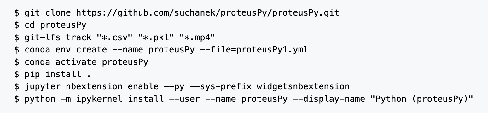
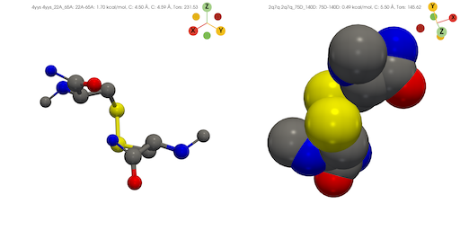
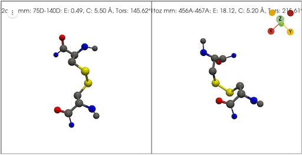
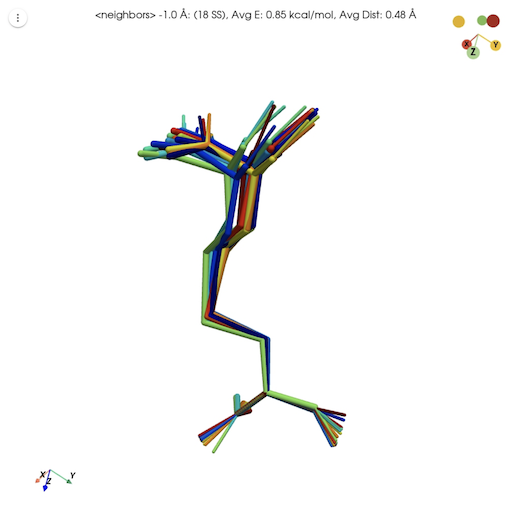

<!-- markdownlint-disable MD014 -->
<!-- markdownlint-disable MD033 -->
<!-- markdownlint-disable MD037 -->
# Summary

**proteusPy** is a Python package specializing in the modeling and analysis of proteins of known structure with an initial focus on Disulfide Bonds. This package significantly extends the capabilities of the molecular modeling program **proteus**, [@Pabo_1986], and utilizes a new implementation of the [Turtle3D](https://suchanek.github.io/proteusPy/proteusPy/turtle3D.html) class for disulfide and protein modeling.  The [Disulfide](https://suchanek.github.io/proteusPy/proteusPy/Disulfide.html) class implements methods to analyze the protein structure stabilizing element known as a **Disulfide Bond**. 

The work has resulted in a freely-accessible database of over 120,494 disulfide bonds contained within 35,818 proteins in the [RCSB Protein Databank.](https:/www.rcsb.org) The library is capable of extracting, comparing, building and visualizing the disulfides contained within the database, facilitating analysis and understanding.

# Statement of Need

Disulfide bonds are the only naturally occuring covalent bond in proteins. They provide important structural stabilization both within and between protein subunits. They can also be involved in enzymatic catalysis, regulate protein activities and protect against oxidative stress. 
I implemented ``proteusPy`` to revisit the [RCSB Protein Databank](https://www.rcsb.org) and do a structural analysis of the disulfide bonds contained therein.

This necessitated the creation an object-oriented database capable of introspection, analysis and display. The API [@API] is available online at: <https://suchanek.github.io/proteusPy/proteusPy.html> and provides more details and numerous examples.

# Requirements

1. PC running MacOS, Linux, Windows
2. 16 GB RAM
3. 2 GB disk space

# Installation

It's simplest to clone the repo via github since it contains all of the notebooks, test programs and raw Disulfide databases.

- Install Anaconda: <http://anaconda.org>
- Install git-lfs:
  - <https://help.github.com/en/github/managing-large-files/installing-git-large-file-storage>
  - Install mamba:
    - mamba info
- From a shell prompt in MacOS:
  ```console
  $ git clone https://github.com/suchanek/proeusPy/proteusPy.git
  $ cd proteusPy
  $ git-lfs track "*.csv" "*.pkl" "*.mp4"
  $ mamba env create --name proteusPy --file=proteusPy.yml
  $ conda activate proteusPy
  $ pip install .
  $ jupyter nbextension enable --py --sys-prefix widgetsnbextension
  $ python -m ipykernel install --user --name proteusPy --display-name "Python (proteusPy)"
  $ cd ..
  $ git clone https://github.com/suchanek/biopython
  $ cd biopython
  $ pip install .

  ## Linux:
   $ git clone https://github.com/suchanek/proeusPy/proteusPy.git
   $ cd proteusPy
   $ ./linux.sh
   $ cd ..
   $ git clone https://github.com/suchanek/biopython
   $ cd biopython
   $ pip install .
 
  ```



# General Usage

Once the package is installed one can use the existing notebooks for analysis of the RCSB Disulfide database. The [notebooks](https://github.com/suchanek/proteusPy/blob/master/notebooks/) directory contains all of my Jupyter notebooks and is a good place to start. The [DisulfideAnalysis.ipynb](https://github.com/suchanek/proteusPy/blob/master/notebooks/DisulfideAnalysis.ipynb) notebook contains the first analysis paper. The [programs](https://github.com/suchanek/proteusPy/tree/master/programs) subdirectory contains the primary programs for downloading the RCSB disulfide-containing structure files:
* [DisulfideDownloader.py](https://github.com/suchanek/proteusPy/blob/master/programs/DisulfideDownloader.py): Downloads the raw RCSB structure files.
* [DisulfideExtractor.py](https://github.com/suchanek/proteusPy/blob/master/programs/DisulfideExtractor.py): Extracts the disulfides and creating the database loaders
* [DisulfideClass_Analysis.py](https://github.com/suchanek/proteusPy/blob/master/programs/DisulfideExtractor.py): Performs cluster analysis on the disulfide database.

The first time one loads the database via [Load_PDB_SS()](https://suchanek.github.io/proteusPy/proteusPy/DisulfideLoader.html#Load_PDB_SS) the system will attempt to download the full and subset database from my Google Drive. If this fails the system will attempt to rebuild the database from the repo's ``data`` subdirectory (not the package's). If you've downloaded from github this will work correctly. If you've installed from pyPi via ``pip`` it will fail.

# Class Details

The primary classes developed for ``proteusPy`` are described briefly below. Please see the [API](https://suchanek.github.io/proteusPy/proteusPy.html) for details.

# [Disulfide](https://suchanek.github.io/proteusPy/proteusPy/Disulfide.html)

This class provides a Python object and methods representing a physical disulfide bond either extracted from the RCSB protein databank or a virtual one built using the [Turtle3D](https://suchanek.github.io/proteusPy/proteusPy/turtle3D.html) class. The disulfide bond is an important intramolecular stabilizing structural element and is characterized by:

- Atomic coordinates for the atoms $N, C_{\alpha}$, $C_{\beta}$, $C'$, $S_\gamma$ for both amino acid residues. These are stored as both raw atomic coordinates as read from the RCSB file and internal local coordinates.
- The dihedral angles $\chi_{1} - \chi_{5}$ for the disulfide bond
- A name, by default: ``{pdb_id}{prox_resnumb}{prox_chain}_{distal_resnum}{distal_chain}``
- Proximal residue number
- Distal residue number
- Approximate bond torsional energy (kcal/mol):
  $$
    E_{kcal/mol} \approx 2.0 * cos(3.0 * \chi_{1}) + cos(3.0 * \chi_{5}) + cos(3.0 * \chi_{2}) +
  $$
  $$
    cos(3.0 * \chi_{4}) + 3.5 * cos(2.0 * \chi_{3}) + 0.6 * cos(3.0 * \chi_{3}) + 10.1
  $$
- Euclidean length of the dihedral angles (degrees) defined as:
$$\sqrt(\chi_{1}^{2} + \chi_{2}^{2} + \chi_{3}^{2} + \chi_{4}^{2} + \chi_{5}^{2})$$
- $C_{\alpha} - C_{\alpha}$ distance ($\AA$)
- $C_{\beta} - C_{\beta}$ distance ($\AA$)
- The previous C' and next N coordinates for both the proximal and distal residues. These are needed to calculate the backbone dihedral angles $\phi$, $\psi$.
- Backbone dihedral angles $\phi$ and $\psi$, when possible. Not all structures are complete and in those cases the atoms needed may be undefined. In this case the $\phi$ and $\psi$ angles are set to -180°.

The class also provides 3D rendering capabilities using the excellent [PyVista](https://pyvista.org) library, and can display disulfides interactively in a variety of display styles:

- 'sb' - Split Bonds style - bonds colored by their atom type
- 'bs' - Ball and Stick style - split bond coloring with small atoms
- 'pd' - Proximal/Distal style - bonds colored *Red* for proximal residue and *Green* for the distal residue.
- 'cpk' - CPK style rendering, colored by atom type:

  - Carbon   - Grey
  - Nitrogen - Blue
  - Sulfur   - Yellow
  - Oxygen   - Red
  - Hydrogen - White

Individual renderings can be saved to a file and animations can be created. The *cpk* and *bs* styles are illustrated below:



# [DisulfideLoader](https://suchanek.github.io/proteusPy/proteusPy/DisulfideLoader.html)

This class encapsulates the disulfide database itself and is its primary means of accession.  Instantiation takes 2 parameters: ``subset`` and ``verbose``. Given the size of the database, one can use the ``subset`` parameter to load the first 1000 disulfides into memory. This facilitates quicker development and testing new functions. I recommend using a machine with 16GB or more to work with the full dataset.

The entirety of the RCSB disulfide database is stored within the class via a [DisulfideList]("https://suchanek.github.io/proteusPy/proteusPy/DisulfideList.html"), a ```Pandas``` .csv file, and a ```dict``` of indices mapping the RCSB IDs into their respective list of disulfide bond objects. The datastructures allow simple, direct and flexible access to the disulfide structures contained within. This makes it possible to access the disulfides by array index, RCSB structure ID or disulfide name.

Example:

```python
  import proteusPy
  from proteusPy.Disulfide import Disulfide
  from proteusPy.DisulfideLoader import DisulfideLoader
  from proteusPy.DisulfideList import DisulfideList

  SS1 = DisulfideList([],'tmp1')
  SS2 = DisulfideList([],'tmp2')

  PDB_SS = DisulfideLoader(verbose=False, subset=True)

  # Accessing by index value:
  SS1 = PDB_SS[0]
  SS1
  <Disulfide 4yys_22A_65A, Source: 4yys, Resolution: 1.35 Å>

  # Accessing by PDB_ID returns a list of Disulfides:
  SS2 = PDB_SS['4yys']
  SS2
  [<Disulfide 4yys_22A_65A, Source: 4yys, Resolution: 1.35 Å>, 
  <Disulfide 4yys_56A_98A, Source: 4yys, Resolution: 1.35 Å>, 
  <Disulfide 4yys_156A_207A, Source: 4yys, Resolution: 1.35 Å>]

  # Accessing individual disulfides by their name:
  SS3 = PDB_SS['4yys_56A_98A']
  SS3
  <Disulfide 4yys_56A_98A, Source: 4yys, Resolution: 1.35 Å>

  # Finally, we can access disulfides by regular slicing:
  SSlist = SS2[:2]
  [<Disulfide 4yys_56A_98A, Source: 4yys, Resolution: 1.35 Å>, 
  <Disulfide 4yys_156A_207A, Source: 4yys, Resolution: 1.35 Å>]
```

The class can also render Disulfides overlaid on a common coordinate system to a pyVista window using the [DisulfideLoader.display_overlay()](https://suchanek.github.io/proteusPy/proteusPy/DisulfideLoader.html#DisulfideLoader.display_overlay) method.

**NB:** For typical usage one accesses the database via the `Load_PDB_SS()` function. This function loads the compressed database from its single source. Initializing a `DisulfideLoader()` object will load the individual torsions and disulfide ``.pkl`` files, builds the classlist structures, and writes the completely built object to a single ``.pkl`` file. This requires the raw ``.pkl`` files created by the download process. These files are contained in the *repository* ``data`` directory, not in the ``pyPi`` distribution.

# [turtle3D](https://suchanek.github.io/proteusPy/proteusPy/turtle3D.html)

The ``turtle3D`` class represents an object that maintains a *local coordinate system* in three dimensional space. This coordinate system consists of:

- A Position in 3D space 
- A Heading Vector
- A Left Vector
- An Up Vector

The Heading, Left and Up vectors are unit vectors that define the 
object's orientation in a *local* coordinate frame. The Turtle developed in `proteusPy` is based on the excellent book by Abelson: [@Abelson_DiSessa_1986]. The [to_local]("https://suchanek.github.io/proteusPy/proteusPy/turtle3D.html#Turtle3D.to_local") and [to_global]("https://suchanek.github.io/proteusPy/proteusPy/turtle3D.html#Turtle3D.to_global") methods convert between these two. These methods make it possible to readily compare different disulfides by:

1. Orienting the turtle at the disulfide's proximal residue in a standard orientation.
2. Converting the global coordinates of the disulfide as read from the RCSB into local coordinates.
3. Saving all of the local coordinates with the raw coordinates
4. Performing distance and angle calculations

By implementing the functions ``Move``, ``Roll``, ``Yaw``, ``Pitch`` and ``Turn`` the turtle is capable of movement in a three-dimensional space. See [@Pabo_1986] for more details.

The turtle has several molecule-specific functions including [orient_at_residue]("https://suchanek.github.io/proteusPy/proteusPy/turtle3D.html#Turtle3D.orient_at_residue") and [orient_from_backbone]("https://suchanek.github.io/proteusPy/proteusPy/turtle3D.html#Turtle3D.orient_from_backbone"). These routines make it possible to build protein backbones of arbitrary conformation and to readily add sidechains to modeled structures. 


# Examples

I will now illustrate a few use cases for the package below. See the notebooks for more examples.

## Find the lowest and highest energy disulfides present in the database

```python
# default parameters will read from the package itself.

PDB_SS = Load_PDB_SS(verbose=False, subset=False)

# display the best and worst SS

ssMin, ssMax = PDB_SS.SSList.minmax_energy()
minmaxlist = DisulfideList([ssMin, ssMax], 'mm')
minmaxlist.display(style='bs', light=True)
```

<center>



</center>

## Find disulfides within 10 $\AA$ RMS in torsional space of the lowest energy structure

In this example we load the disulfide database, find the disulfides with
the lowest and highest energies, and then find the nearest conformational neighbors.
Finally, we display the neighbors overlaid against a common reference frame.

```python
import proteusPy
from proteusPy.DisulfideLoader import DisulfideLoader
from proteusPy.DisulfideList import DisulfideList
from proteusPy.Disulfide import Disulfide

PDB_SS = None
PDB_SS = Load_PDB_SS(verbose=False, subset=True)
ss_list = DisulfideList([], 'tmp')

# We point to the complete list to search for lowest and highest energies.
sslist = PDB_SS.SSList

# Return the minimum and maximum energy structures. We ignore tha maximum in this case.
ssmin_enrg, _ = PDB_SS.SSList.minmax_energy()

# Make an empty list and find the nearest neighbors within 10 degrees avg RMS in
# sidechain dihedral angle space.

low_energy_neighbors = DisulfideList([],'Neighbors')
low_energy_neighbors = ssmin_enrg.Torsion_neighbors(sslist, 10)

# Display the number found, and then display them overlaid onto their common reference frame.

tot = low_energy_neighbors.length
low_energy_neighbors.display_overlay()
```

18

<center>


</center>

# Analyzing Disulfide Structural Class Distributions

The package includes the [DisulfideClassConstructer](https://suchanek.github.io/proteusPy/proteusPy/DisulfideClass_Constructor.html) class, which is used to create and manage Disulfide binary and sextant classes. A note about these structural classes is in order. [@Schmidt_2006] described a method of characterizing disulfide structures by describing each individual dihedral angle as either + or - based on its sign. This yields $2^{5}$ or 32 possible classes. The author then was able to identify protein functional families within one of 20 remaining structural classes. Since the binary approach is very coarse and computational resources are much more capable than in 2006 I extended this formalism to a *Sextant* approach. In other words, I created *six* possible classes for each dihedral angle by dividing it into 60 degree segments. This yields a possible $6^5$ or 7,776 possible classes. The notebook [DisulfideClassesPlayground.ipynb](https://github.com/suchanek/proteusPy/blob/master/notebooks/DisulfideClassesPlayground.ipynb) contains some initial results. 

# Appendix

## Database Creation Workflow

The following steps were performed to create the RCSB disulfide database:

1. Identify disulfide containing proteins in the [RCSB](https://www.rcsb.org). I generated a query using the web-based query tool for all proteins containing one or more disulfide bond. The resulting file consisted of 35,819 IDs.
2. Download the structure files to disk. This resulted in the program [DisulfideDownloader.py](https://github.com/suchanek/proteusPy/blob/master/programs/DisulfideDownloader.py). The download took approximately twelve hours.
3. Extract the disulfides from the downloaded structures. The program [DisulfideExtractor.py](https://github.com/suchanek/proteusPy/blob/master/programs/DisulfideExtractor.py) was used to extract disulfides from the individual structure files. This seemingly simple task was complicated by several factors including:

   1. The PDB file parser contained in Bio.PDB described in [@Hamelyrck_2003] lacked the ability to parse the `SSBOND` records in PDB files. As a result I forked the Biopython repository and updated the `parse_pdb_header.py` file. My fork is available at: [https://github.com/suchanek/biopython]("https://github.com/suchanek/biopython")
   2. Duplicate disulfides contained within a multi-chain protein file.
   3. Physically impossible disulfides, where the $C_\alpha - C_\alpha$ distance is > 8 $\AA$ .
   4. Structures with disordered CYS atoms.

In the end I elected to only use a single example of a given disulfide from a multi-chain entry, and removed any disulfides with a $C_\alpha - C_\alpha$ distance is > 8 $\AA$. This resulted in the current database consisting of 35,808 structures and 120,494 disulfide bonds. To my knowledge this is the only searchable database of disulfide bonds in existence.

## The Future

- I continue to explore disulfide structural classes using the sextant class approach. This offers much higher class resolution than the binary approach and reveals subgroups within the broad class. I'd also like to explore the catalytic and allosteric classes within the subgroups to look for common structural elements.

- I am working to deploy a Disulfide Database browser for exploration and analysis.
  
## Miscellaneous

*Developer's Notes:*
The .pkl files needed to instantiate this class and save it into its final .pkl file are
defined in the [proteusPy.data]("https://suchanek.github.io/proteusPy/proteusPy/data.html") class and should not be changed. Upon initialization the class will load them and initialize itself.

*NB:* [@proteusPy] disulfide database creaton relies on my [fork](https://github.com/suchanek/biopython) of the [Biopython](https://biopython.org) Python package to download and build the database, (<https://github.com/suchanek/biopython>). As a result, one can't download and create the database locally unless the BioPython patch is applied. The changed python file is in the repo's data directory - ``parse_pdb_header.py``. Database analysis is unaffected without the patch. Also, if you're running on an M-series Mac then it's important to install Biopython first, since the generic release won't build on the M1.

# Bibliography
