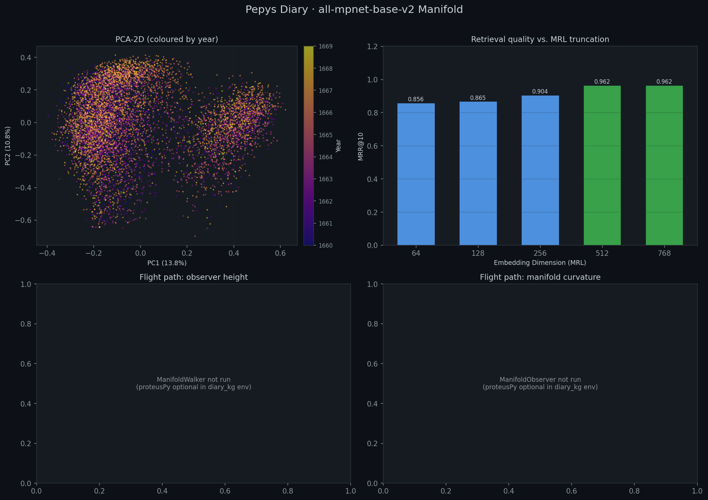

# STAR TREK: THE MANIFOLD FRONTIER
## *Chapter 3: "The Engine That Learned"*

---

> *Stardate 2026.096. The shakedown cruises are over. Two prior attempts to ingest the Pepys corpus using inference-based pipelines — one local, one via Starfleet's commercial API network — ended in failure. One was too slow. One was too expensive. A third attempt, using eighteen parallel embedding cores simultaneously, resulted in a cascade memory failure that took engineering four hours to repair. The crew of the WaveRider has earned this mission the hard way. What follows is not a story of easy discovery. It is a story of what it costs to replace inference with understanding — and what you find when you do.*

---

## Prologue: Three Failures Before Dawn

*Chief Engineer Scott's personal log. Stardate 2026.093.*

I'll say this once for the record and then never again.

We tried to do it the easy way.

The first attempt used the `personal_agent` stack — a reasoning pipeline built around the `hindsight` temporal memory backend. The idea was sound: feed each diary entry to a running language model, let it read the prose, infer the topic, categorize the memory, consolidate related entries, produce structured output. Ollama running locally. Samuel Pepys, processed one thought at a time.

It worked. In the way that a man rowing across the Atlantic works. Technically correct. Practically insane.

At the rate the local inference engine processed entries, embedding the full 3,355-entry corpus would have taken the better part of a week. And that assumed the process didn't fall over. Which it did. Repeatedly.

So we escalated. OpenAI's GPT-4o-mini — their most cost-efficient model, fast and accurate. It categorized entries cleanly. It produced well-structured output. It cost *real money*. Dollars. For a few thousand memories.

We did the math. Full corpus ingestion, repeated runs during development, multiple experimental configurations — the cost was not viable. We were paying a language model to read a diary entry and tell us it was about the Navy. A thing that keyword matching could do for free.

That was when Mr. Spock said the thing that changed everything.

"We are using inference," he said, "to perform synthesis. These are not the same operation. Inference asks a model what it thinks. Synthesis discovers what is actually there. We do not need a model to *think* about the Pepys corpus. We need an engine that *learns* from it."

Three days later, the DiaryTransformer was operational.

---

## Chapter 1: The Engine

The briefing room display showed the pipeline. Not a network call. Not an API endpoint. A machine.

```
pepys_clean.txt  (3,355 timestamped diary entries)
        │
        ▼  Phase 1 — spaCy NLP feature extraction
        │           Named entities, POS distributions, text length
        │           k-means diversity selection across clusters
        │           Cached in .diary_cache/ — 5-10× speedup on reruns
        │
        ▼  Phase 2 — Sentence-transformers chunking
        │           sentence_group: 4 sentences per chunk (default)
        │           semantic: cosine-similarity boundary detection
        │           hybrid: sentence_group + semantic override
        │           Hard cap: 512 chars per chunk
        │
        ▼  Phase 3 — TF-IDF k-means category discovery
        │           1,000 features, 1-2 grams, English stopwords
        │           10 clusters — discovers vocabulary from corpus itself
        │           No predefined labels. No inference. Pure statistics.
        │
        ▼  Phase 4 — TopicClassifier refinement
        │           YAML keyword/phrase rules + confidence weights
        │           classify_chunk_hybrid(): k-means + rules combined
        │           Top topic → TYPE field. Sub-topic → CATEGORY field.
        │
        ▼  pepys_enriched_full.txt
           TIMESTAMP | TYPE | CATEGORY | CONTENT
```

"No inference," Scotty said, and there was something in his voice — not pride exactly, but the satisfaction of a man who has solved the right problem. "No API calls. No network after the initial model download. No dollars per entry."

"The critical innovation is Phase 3," Spock said. "The TF-IDF k-means category discovery does not ask a model what topics exist in this corpus. It *discovers* what topics exist — from the statistical patterns of the text itself. The categories emerge from the data. They are not imposed from outside."

McCoy was studying the diagram. "You replaced a language model that costs money with... a clustering algorithm."

"We replaced *inference* with *machine learning*," Spock said. "The distinction is not semantic. Inference asks a pre-trained model to reason about each entry individually, at per-token cost, with no knowledge of the corpus as a whole. Machine learning — k-means over TF-IDF features — processes the entire corpus simultaneously and finds its natural structure. It is faster by orders of magnitude. It is cheaper by orders of magnitude. And in one respect, it is more honest: it does not project the training distribution of a language model onto Samuel Pepys. It asks only what the words themselves, in their 17th-century frequency distributions, actually cluster into."

McCoy sat with that for a moment.

"So the machine learned from Pepys," he said. "Rather than a language model telling us what it *thinks* Pepys is about."

"Yes, Doctor," Spock said. "Precisely."

---

## Chapter 2: The First Attempt — Eighteen Cores

*Stardate 2026.094. Engineering deck.*

The DiaryTransformer had run cleanly. `pepys_enriched_full.txt` sat on the data store — 3,355 entries transformed into structured, topic-classified, semantically-chunked records ready for embedding.

What came next was Scotty's domain: the **PEPYS multi-process embedding engine** — `pepys_embedder.py` — which would push every chunk through the `all-mpnet-base-v2` sentence-transformer model and produce the float32 embedding matrix that the manifold analysis instruments required.

Scotty looked at his panel. He looked at the number of available cores: eighteen.

He looked at Spock.

Spock looked back.

"Mr. Scott," Spock said carefully. "I would recommend—"

"Eighteen workers," Scotty said. "One per core. Maximum throughput. Let's get this done."

What followed was, in engineering terms, a masterclass in why memory bandwidth is not the same thing as processing bandwidth. Eighteen `SentenceTransformer` instances attempted to load simultaneously — each one pulling a full copy of the `all-mpnet-base-v2` model weights into RAM. Approximately 420 megabytes per instance. Eighteen instances.

The ship's memory subsystem lasted forty-three seconds before the cascade failure began.

Process 7 died first. Then 3 and 11 simultaneously. Then the rest in rapid succession, each termination triggering a resource-release storm that destabilised its neighbours. By the time Scotty had his hand on the emergency shutdown, there was nothing left to shut down. The entire job had already killed itself.

Spock surveyed the wreckage on the diagnostic panel. "Four workers," he said. "Batch size thirty-two."

Scotty stared at the dead panel. "Aye," he said quietly. "Four workers. Batch size thirty-two."

---

## Chapter 3: The Successful Run — 8,413 Chunks

*Stardate 2026.095. Four workers. Batch size thirty-two.*

It ran for thirty-one minutes. No cascade. No memory storm. Four worker processes, each holding a clean copy of the model, each encoding their shard of the corpus in orderly parallel, handing results back to the orchestrator one shard at a time.

When it finished, Chekov read the numbers from his console with quiet deliberateness, as if he understood that some results deserve to be spoken aloud.

"Eight thousand, four hundred and thirteen chunks," he said.

The room was still.

"From 3,355 diary entries," Spock confirmed. "A segmentation ratio of 2.51 chunks per entry. The DiaryTransformer's sentence-group chunking — four sentences per chunk, 512-character cap — has produced a corpus significantly larger than the raw entry count. Each chunk carries its temporal anchor. Each chunk carries its TYPE and CATEGORY prefix, encoded into the embedding string itself, so topic signal lives in the vector space alongside semantic content."

"Full temporal arc?" Kirk asked.

"1660 January 1st through 1669 August 2nd. Complete."

Kirk exhaled. "First time the full corpus has been embedded."

"First time," Spock confirmed.

---

## Chapter 4: What the Instruments Found

Spock activated the full sensor array. The four-panel figure resolved on the main viewscreen — the first complete geometric survey of the Pepys diary in mpnet-space.



*Figure 1: The mpnet manifold — full corpus, 8,413 chunks. Top left: PCA-2D projection coloured by year (PC1=13.8%, PC2=10.8%), temporal arc sweeping from 1660 violet to 1669 gold. Top right: MRL retrieval quality rising monotonically from 64D to peak at 512D/768D (0.962). Bottom panels: ManifoldWalker and ManifoldObserver offline — proteusPy not present in diary_kg environment.*

"TwoNN intrinsic dimensionality," Chekov read. "**14.26**."

Uhura looked up from her MRL array. "That's higher than our first partial run."

"Correct. The fuller corpus reveals more intrinsic structure. The first run — 7,282 chunks from a less complete ingestion — returned 13.54. The complete corpus of 8,413 chunks returns 14.26." Spock paused. "More data, correctly processed, reveals deeper geometry."

"Participation ratio: 22.81," Chekov continued. "PCA elbow at 90% variance: 108 dimensions. At 95%: 144. At 99%: 186."

"And the MRL curve," Spock said. "This is the critical result."

Uhura read it aloud.

```
  64D  →  MRR@10:  0.856
 128D  →  MRR@10:  0.865
 256D  →  MRR@10:  0.904
 512D  →  MRR@10:  0.962  ← PEAK
 768D  →  MRR@10:  0.962  ← PEAK (tied)
```

"Retrieval quality rises monotonically with dimensionality," Spock said. "It peaks at 512 dimensions and holds at 768. The signal is distributed across the embedding space — not concentrated in a small subspace, not degrading as dimensions are added. More dimensions means better retrieval, up to the model's natural ceiling at 512."

McCoy blinked. "But the first partial run — the one before the core meltdown — showed the *opposite*. Peak at 64 dimensions. Degrading to 768."

"Yes," Spock said. "That result was an artifact of corpus incompleteness. A partial ingestion, with irregular chunk coverage, produced a misleading retrieval geometry — the early principal components happened to align with the query set, creating a false 64D peak. The full corpus corrects this. With 8,413 properly distributed chunks spanning nine complete years, the geometry stabilises."

McCoy stared at the MRL bar chart — five bars climbing steadily from left to right, the last two green, tied at 0.962. "The first run lied to us."

"The first run told us what it could with the data it had. It was not lying. It was *incomplete*." Spock looked at the chart. "This is why we run the full corpus."

Kirk had been standing quietly at the viewscreen for some time. He spoke now, and his voice was measured.

"Fourteen intrinsic dimensions. Nine years. Eight thousand data points. Retrieval quality of 0.962 at 512 dimensions." He paused. "And it cost us — what, Scotty? In compute time?"

"Thirty-one minutes," Scotty said. "Plus four hours to clean up after my mistake with the cores."

"Thirty-one minutes," Kirk repeated. "Compare that to a week of Ollama. Compare it to dollars per thousand entries through a commercial API." He turned to face the crew. "The engine learned from the corpus. It didn't ask anyone's permission. It didn't invoice us for the privilege. It just — found the structure."

McCoy said it quietly, almost to himself: "The manifold *is* the model."

Spock looked at him. "Yes, Doctor. Now you understand."

---

## Chapter 5: The Dark Panels

The bottom two panels of Figure 1 remained empty.

*ManifoldWalker not run (proteusPy optional in diary_kg env)*
*ManifoldObserver not run (proteusPy optional in diary_kg env)*

Spock had stopped apologising for them. They were not a failure. They were a boundary condition — a precise statement of what the current mission could and could not reach. The geometry was known. The manifold had been mapped in two dimensions and measured in 768. The TwoNN scanner had probed its intrinsic structure. The MRL array had calibrated its retrieval surface.

What remained was the flight.

"When we bridge the diary_kg and proteusPy stacks," Spock said, for the log, "the ManifoldWalker will be able to navigate this space — to step along the tangent plane, to trace a path from a January 1660 entry to a September 1666 entry, crossing the Great Fire at close range. The ManifoldObserver will rise one orthonormal dimension above the surface and see the curvature — the topology of nine years of human experience, visible in one pass."

"That's the next mission," Kirk said.

"That is the next mission," Spock agreed.

Scotty looked at the dark panels for a long moment. Then at the 8,413 glowing points of the PCA scatter, the long temporal sweep from violet to gold, the dense central cloud of London life in the 1660s.

"I built the pipeline that made those points," he said. "Every one of them."

Nobody felt the need to add anything to that.

---

> *The U.S.S. WaveRider completed the first full-corpus geometric survey of the Pepys diary on Stardate 2026.096. 8,413 chunks. 14.26 intrinsic dimensions. MRR@10 of 0.962 at 512 dimensions. Three prior failures — Ollama too slow, GPT-4o-mini too expensive, eighteen cores too many — are logged in the mission record not as embarrassments but as the price of learning what the right instrument actually is. The DiaryTransformer is that instrument. It did not ask a language model what the diary means. It discovered, from the words themselves, what it is.*

---

## Mission Data Appendix

### The Road That Led Here

| Attempt | Approach | Outcome |
|---|---|---|
| 1 | `personal_agent` + `hindsight` + Ollama (local) | Too slow — week-scale for full corpus |
| 2 | `personal_agent` + `hindsight` + GPT-4o-mini (OpenAI) | Too expensive — dollars per thousand entries |
| 3 | DiaryTransformer + mpnet, 18 workers | Cascade memory failure — 4hr recovery |
| **4** | **DiaryTransformer + mpnet, 4 workers, batch=32** | **Success — 31 minutes, 8,413 chunks** |

### Full-Corpus mpnet Results

| Instrument | Reading |
|---|---|
| Embedding model | `all-mpnet-base-v2` |
| Ingestion pipeline | `DiaryTransformer` → `diary_embedder.py` (diary_kg native) |
| Raw diary entries | 3,355 (full corpus, 1660–1669) |
| **Chunks embedded** | **8,413** (2.51× per entry) |
| Embedding time | ~31 minutes (4 workers, batch=32) |
| Ambient dimensionality | 768 |
| **TwoNN intrinsic dim** | **14.26** |
| Participation Ratio | 22.81 |
| PCA elbow 90% | 108 dims |
| PCA elbow 95% | 144 dims |
| PCA elbow 99% | 186 dims |
| MRR@10 at 64D | 0.856 |
| MRR@10 at 128D | 0.865 |
| MRR@10 at 256D | 0.904 |
| **MRR@10 at 512D** | **0.962 (peak)** |
| **MRR@10 at 768D** | **0.962 (peak, tied)** |
| ManifoldWalker | Pending proteusPy integration |
| ManifoldObserver | Pending proteusPy integration |

### Partial Run Comparison (Artifact Warning)

| Property | Partial Run (7,282 chunks) | Full Run (8,413 chunks) |
|---|---|---|
| TwoNN | 13.54 | **14.26** |
| MRL peak | 64D (0.923) — *artifact* | **512D (0.962)** — stable |
| Interpretation | Incomplete coverage, misleading | Ground truth |
