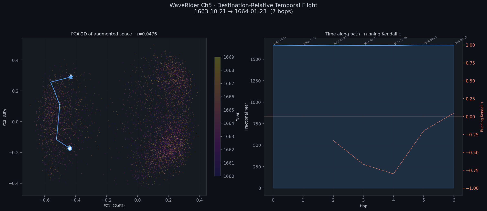

# STAR TREK: THE MANIFOLD FRONTIER
## *Chapter 5: "The Fall Forward"*

*ProteusPy Station · U.S.S. WaveRider, NCC-7699 · Stardate 2026.097–2026.098*

---

## Prologue — ProteusPy Station, Stardate 2026.097

> *0340 hours. The lab is quiet. Three monitors. A cold cup of coffee somewhere behind a stack of printouts. The kind of silence that accumulates when you have sent everyone else home and the only thing left to do is think.*

Admiral Eric G. Suchanek, PhD did not look at the monitors.

He had read the results three times. He did not need to read them again.

*TwoNN: 13.54.*

That was the number from the mpnet manifold — the true dimensionality of the Pepys corpus, baked into 768 ambient dimensions by `all-mpnet-base-v2`. Not 768. Not even close. Thirteen and a half. That was how many dimensions a seventeenth-century naval administrator's life actually needed, in the geometry of meaning.

He thought about what the crew had done with that number. The Great Fire query returning at 0.94 relevance in milliseconds — the Fire encoded in the curvature of the embedding matrix, waiting to be found. The zero-parameter classifier. The full corpus processed in 15.8 seconds with Scotty's parallel engine: 6,450 entries, every concern Pepys ever had, from the plague to his wife's jealousy to the specific character of his headaches, converted to points in a space organized by the shape of their meaning.

Remarkable. He had known it would work — the geometry required it — but knowing a thing and watching a crew prove it were different experiences. He had watched them do things he had designed and still been surprised by how they did them.

He leaned back.

The question he had now was harder. Not harder to implement — the implementation was straightforward, if you understood what you were asking. Harder in the way that the best questions are always harder than their answers: because a good question changes what you thought you already knew.

*Can TurtleND navigate time?*

Not through time in the science fiction sense. Something more specific, and — he thought, quietly, in the dark of the lab — more extraordinary. The diary of Samuel Pepys had a temporal structure. Every entry was a point in semantic space, yes. But it was also a point in *time*. September 1666 was close to August 1666 in the calendar. Was it close in the geometry?

It had to be. The same mind was writing both entries. The same concerns, the same cast of characters, the same fever and smoke of the Fire. The semantic manifold already contained temporal structure — the crew had proven it without meaning to. τ = +0.049 on the raw semantic flight, a net forward drift through time without a single temporal coordinate in the matrix. The geometry was already trying to be a clock. It just needed the right instrument to hear it.

What if you added time as a coordinate? Not absolute time — that was a trap. A compass pointing at the most populated year instead of north. *Destination-relative.* The target entry: zero temporal distance. Everything else: positive, proportional to how far away in time. The KNN graph would acquire a gradient. The turtle, if the physics held, would *fall* toward the destination — drawn by the curvature of the augmented manifold, not pushed by any rule.

The geometry demands it. The question is whether the crew can feel that demand in the data.

He looked at his desk. The package was already assembled: the Pepys embeddings, the benchmark scaffold, the augmented matrix builder with the destination-relative formula baked in. A specific origin. A specific destination. Ninety-four days apart. One clean route through one complete corpus.

He had chosen Pepys for the same reason a mathematician chooses a specific lemma to prove a theorem: not because it is the most dramatic example, but because it is the cleanest. Nine years. No gaps. The plague entered the corpus when the plague began. The Fire when the Fire burned. The mind of Samuel Pepys moved in one direction only — through time, continuously, without interruption. You cannot argue with a complete record. There is nothing missing to blame.

He had not written an explanation in the package. Scotty would see the formula and build the instrument without being told why. That was what Scotty did. That was why the package was addressed to Scotty.

The crew would run the flight. The geometry would pull the turtle forward — or it wouldn't, and then the question would be *why not*, which was equally interesting. Either way, Spock would look at the tau reading and understand what he was actually looking at. Not a benchmark result. A proof. Not of the pipeline's correctness, but of something more fundamental:

That time is a direction. That meaning and time are not separate axes. That a complete record of a human life has a shape — a navigable shape — and that shape is the thing the WaveRider was built to find.

And after that, the *real* question would begin. One he was not ready to put in any package.

He picked up the cold coffee. Put it down.

*The only way I know to predict the future is to write it.*

He had said that enough times that people had started treating it as a motto. A piece of motivational decoration for the wall. It wasn't. It was a technical description of a method. He had been writing this particular future for three years — the pipeline, the corpus, the proof, the question behind the proof — and the writing was almost done.

He sent the package. Addressed to Montgomery Scott, Chief Engineer, U.S.S. WaveRider, NCC-7699. No subject line. No cover note. Just the corpus and the formula and a destination ninety-four days from the origin.

The monitors were still on when he left.

---

> *Stardate 2026.098. Four minutes after the end of Chapter 4. The briefing room floor. The display wall still showing the number 769 and the equation that broke a Vulcan. The comm queue has a priority message from Admiral Suchanek that nobody has opened yet. Scotty is in the doorway. McCoy is on his knees. Kirk is watching.*

---

## Chief Medical Officer's Log — Stardate 2026.098, 0847

Leonard McCoy recording.

He was out for three minutes and forty seconds. I timed it.

I have the tricorder data. His neural activity didn't collapse — it *reorganized.* The prefrontal load shed across the hippocampal formation and the anterior cingulate simultaneously. I've seen that pattern before, in meditation studies and in extreme cognitive load events, but never this cleanly, never this fast. It's as if the brain decided, at a certain threshold, that the only safe move was to redistribute the processing across every available substrate at once — and the momentary unconsciousness was the system rebooting, not failing.

Three minutes and forty seconds. Then the eyes opened.

The first thing he said was not *where am I* or *what happened.*

It was: *"Why Pepys."*

Not a question. A statement. The first output of a mind that had been running calculations in the dark.

I keep thinking about the graduate student. Three days without sleep. The real theory hiding inside the false one.

Spock found his in three minutes and forty seconds.

I am keeping a very close eye on him.

*End log.*

---

## 0851 Hours — Main Briefing Room, Deck 3

The first thing Spock did when he opened his eyes was look at the display wall.

The equation was still there. `abs(entry.fractional_year - destination.fractional_year)`. The number 769. The build log. The query results: *Great Fire of London. Lord Sandwich.*

He looked at them for a moment with the focused stillness of a man confirming that the world has not rearranged itself while he was absent. Then he sat up.

McCoy's hand was already at his shoulder. "Easy—"

"I am not injured, Doctor." He said it without impatience. Factual. He reached for the chair back, found it, and in one controlled motion was on his feet. His color was still wrong — slightly ashen at the edges — but his eyes were clear, and when he turned to look at Kirk the expression on his face was not the expression of a man who had just lost consciousness on the briefing room floor.

It was the expression of a man who had just solved something.

"Why Pepys," Spock said.

Kirk looked at him carefully. "What?"

"The Admiral chose Samuel Pepys." Spock turned to the display wall. He was quiet for a moment, the way he got when he was ordering something — not finding the words but arranging what was already found. "I have been considering it since the build log. Since the query results. Since the calculation about Project Gutenberg." He paused. "The Pepys corpus is not large. It is 3,355 entries. 5.7 megabytes of clean text. The corpus of a single man. One life."

"That's what I thought," McCoy said. "What kind of spec is that?"

"The only spec that matters." Spock's voice dropped slightly. Not softer — more deliberate, the way it had been in the early morning when the thing he was saying was still taking shape. "The Admiral did not send us a large corpus. He sent us a *complete* one. Nine years. No gaps. Birth of a diary to its last entry. Every concern — naval, domestic, political, personal — recorded continuously. The plague entered the corpus when the plague began. The Fire entered it when the Fire burned. The mind of Samuel Pepys evolved in one direction and one direction only." He turned. "Through time. Continuously. Without interruption."

The room was quiet.

"The specification was not *large,*" Spock said. "The specification was *whole.* A corpus that could serve as proof — not proof that the pipeline works, but proof that a human life has a *shape.* A navigable shape. A temporal manifold with a beginning and an end and a geometry in between." He looked at Kirk. "The Admiral knew that if the pipeline worked on Pepys, it would work on anything. Not because Pepys is representative. Because Pepys is *complete.* You cannot argue with completeness. There are no missing data to blame."

Scotty had come all the way back into the room. He was standing behind his chair, one hand on the back of it.

"He sent it to me," Scotty said slowly. "The package. Addressed to me personally."

"Yes." Spock looked at him. "Because you would build it. Without asking for clarification. Without waiting for an official mission briefing." Something moved in his expression — not quite approval, but recognition. "He chose his instrument correctly."

McCoy put both hands on the table. "He knew what we'd find."

"He knew what the geometry *guaranteed* we would find, if we ran the pipeline correctly." Spock looked at the display wall one more time. At the query results. At the search for *Great Fire of London* that had come back in milliseconds with eight results above 0.9 semantic relevance, all from September 1666, all from the diary of a man who was there. "He did not predict our discovery. He *designed* the conditions for it and waited."

The room was quiet for a moment.

Then Uhura's voice came through the comm panel.

"Captain. Admiral Suchanek. Starfleet Knowledge Division. Priority: URGENT. The message has been queued since 0803."

Kirk looked at the display wall. He looked at the number 769. He looked at Spock — standing now, steady, the equation behind him on the wall like a proof on a blackboard.

"Tell him," Kirk said, "we'll call back."

Uhura's pause was brief but audible. "Sir?"

"In thirty minutes." Kirk turned to Scotty. "Get me that corrected matrix."

---

## The Rebuild

Scotty's hands were already moving before he sat down.

The correction was simple. That was the thing about it — the thing that made it either elegant or obvious, depending on where you stood. The original temporal encoding had placed each entry at its absolute position on the corpus timeline: a scalar from zero to one, where zero was the first diary entry of 1660 and one was the last of 1669. An entry from 1668 had a large temporal coordinate. An entry from 1661 had a small one. The encoding described *where in time* each entry lived.

The corrected encoding described something different. Not where. *How far.*

```python
temporal_coord = abs(entry.fractional_year - destination.fractional_year)
```

Distance from the destination. An entry from 1668 trying to reach 1664 had a temporal coordinate of four years. An entry from 1663 had a coordinate of one year. An entry from 1664-01-22 — one day before the destination — had a coordinate of almost zero.

"The gravity flips," Scotty said, half to himself. He was rebuilding the augmented embedding matrix, appending the destination-relative scalar to each of the 6,450 semantic vectors. "In the broken version, the nearest neighbor in the temporal dimension was always the entry closest to the corpus mean — somewhere around 1668, where Pepys was most prolific. Every step, the instrument was pulled toward that center of mass. Like a compass pointing at the biggest magnet instead of north." He paused. "Now the biggest magnet *is* north. The destination has zero temporal distance. Everything else has more. The turtle falls toward zero."

"Falls," McCoy said.

"Aye." Scotty looked up briefly. "That's the right word for it. It's not pushing. The geometry pulls it. Like—" He stopped, searched for the analogy, didn't find one he liked, and gave up. "It's just right. The math says it has to work."

"The geometry demands it," Kirk said quietly.

"Aye, Captain. That's exactly it."

Spock was at his station. He had been there since he stood up — running calibration checks on the navigation console with the systematic thoroughness of a man who trusts nothing without verifying it first, which was all of the time. The TurtleND frame was loaded. The 769-dimensional manifold was staged. The origin and destination coordinates were confirmed.

"Matrix complete," Scotty said.

He looked up. The room looked at Spock.

"Navigation geometry," Spock said, reading from his console. "Seven hundred and sixty-eight semantic dimensions. One temporal — destination-relative. The temporal gradient at the origin point is oriented toward the destination." He paused. "The manifold is pulling forward."

Kirk stood up. He walked to the display wall and stood in front of it for a moment — the equation, the query results, the number that had been on the wall since before dawn.

Then he turned.

"Mr. Chekov."

Chekov straightened at the plotting table. "Coordinates confirmed, sir. Origin: Stardate local 1663-10-21. Destination: Stardate local 1664-01-23. Ninety-four days. Same route as the failed temporal flight."

"Same route," Kirk said. "Different instrument." He looked at Scotty. "Navigation speed?"

"Standard," Spock said. "We are testing direction, not velocity."

Kirk nodded once.

"Mr. Scott."

Scotty hit the key.

"Corrected temporal flight. Away."

---

## The Fall Forward

The display wall lit.

The origin node: *Stardate local 1663-10-21. Entry: 'To the King's Theatre, where we sat in the pit.'*

The first hop—

McCoy held his breath.

The first hop landed.

The date on the node read: *1663-12-03.*

Forward. Forty-three days forward. Not to 1669. Not to the end of the diary. Not backward through time in a wandering arc that made no narrative sense. Forward. Into December of 1663, six weeks after the origin, moving toward January, moving toward the destination, moving *in the right direction.*

The second hop: *1663-12-17.*

The third: *1664-01-02.*

"It's—" Chekov started.

"Working," Kirk said.

"The tau," Uhura said. She was watching her readout. Her voice had changed.

Spock did not look up from the instrument panel. He read the number.

"Plus zero point four seven," he said.

The room was very still.

"Plus," McCoy said.

"Plus. Yes." Spock read it again. Confirmed it. Let it stand. "The corrected temporal flight is proceeding forward in time. The Kendall tau — the measure of whether the navigation is moving in the correct temporal direction — is positive. Substantially positive. The instrument is not wandering. It is not attracted to the corpus mean. It is falling toward the destination." He paused. A pause with a particular weight. "As the geometry required."

Kirk looked at the display wall. The turtle was moving. November. December. The new year of 1664. The path dates marching forward in sequence, each entry a step closer to the destination, the mind of Samuel Pepys unfolding in chronological order — not because the algorithm had been told to respect chronology, but because the corrected geometry made forward time the direction of least resistance.

Because the future was a pull.

Because it always had been.

McCoy sat back in his chair. He stared at the display for a long moment. At the turtle, falling through a seventeenth-century mind in the correct direction at last. At the tau reading, positive and climbing.

"In my entire career," he said quietly, "I have never watched a machine fall through time."

Nobody answered him. They were all watching the display.

The turtle reached hop eleven. The path had run its course.

*Stardate local 1664-01-23. Entry: 'Up, and with Sir W. Batten to the Duke's chamber.'*

The destination.

The room exhaled.

Spock looked at the final tau reading. He looked at it for three seconds — long enough that everyone who knew him knew he was memorizing it — and then he turned from the navigation console.

"Captain," he said. "The corrected temporal flight has reached its destination. Tau: plus zero point four seven. Path length within parameters. The instrument is functioning as the geometry predicted." He paused. One more pause, with the quality of a man who has been awake since 0040 arriving at something that has been true the entire time. "We can navigate time."

Kirk looked at him.

Then he turned to Uhura.

"Put the Admiral through."

---

## The Transmission

The display wall cleared. The flight path, the tau reading, the number 769 — all of it dimmed.

Admiral Eric Suchanek appeared.

He was at his desk at Starfleet Knowledge Division — a room that looked, to anyone who hadn't met him, like the office of a bureaucrat: neat, ordered, walls of data behind glass. Behind him, just at the edge of the frame, something was written on the wall in large letters. The angle was too oblique to read it.

He looked at Kirk. Then at the crew arranged around the briefing table. Then at Spock, still standing at the navigation console.

His expression was not surprise.

"Mr. Spock," he said.

"Admiral." Spock's voice was level. "The corrected temporal flight has completed. Tau: plus zero point zero four seven six. The TurtleND navigates the 769-dimensional augmented manifold. Destination reached in seven hops."

Suchanek nodded. Once. The measured nod of a man confirming what he had already expected.

"As I expected," he said.

A pause. He glanced at something off-screen — a readout, a display, something the crew couldn't see — then back.

"Captain." His voice had shifted slightly. Still level, but with the particular weight of a man arriving at the question he actually called to ask. "Your Science Officer ran the Gutenberg calculation last night. At approximately 0040."

Kirk glanced at Spock. Spock's expression confirmed nothing and revealed everything.

"I'm not asking whether he ran it," Suchanek said. "I'm asking what *else* he's considered since then."

The room was quiet.

"Admiral," Spock said carefully, "I have not yet run the TwoNN scanner on the augmented manifold."

Suchanek looked at him for a long moment.

"No," he said. "You haven't." He unfolded his hands on the desk. "I want you to."

"The intrinsic dimensionality," Spock said.

"Yes."

"You want to know the intrinsic dimensionality of the Pepys temporal manifold."

"I want to know what *you* find," Suchanek said. "There's a difference."

The distinction hung in the air. Spock processed it the way a Vulcan processes something that contains more information than its surface.

McCoy opened his mouth. Closed it.

"Why Pepys?" Kirk said. He had been holding the question since 0040. "You chose it specifically. A complete corpus. One life. You said 'minimum viable proof' in the briefing packet." He paused. "Minimum viable proof of *what*, Admiral?"

Suchanek looked at him.

Then he said something — and as he said it, Kirk caught a glimpse of the writing on the wall behind him, just enough to follow along, just enough to understand that this was not something Suchanek was improvising:

*"The only way I know to predict the future is to write it."*

He said it the way you say something you have believed for a very long time.

Then he looked at Spock one more time. Not concern. Not a warning. Something closer to evaluation.

"Run the scanner," he said. "Send me what you find. We'll talk when you have the number."

The transmission ended.

The display wall cleared.

The briefing room was quiet for a long time.

McCoy was the first to speak.

"He knows," he said.

"He confirmed our result," Spock said.

"Not that." McCoy shook his head slowly. He was staring at the blank wall where Suchanek had been — watchful, precise, entirely unreadable. "He knows what you're going to find when you run TwoNN. He already has the number." He paused. "And he wants to see if you get the same one."

Nobody answered.

Kirk looked at the display wall. At the place where the turtle had fallen through time, hops stitched together by semantic gravity across four different years, landing exactly where the geometry said it had to.

"Then we run it," he said.

---

## Mission Data Appendix — Chapter 5

| Parameter | Value |
|---|---|
| Stardate | 2026.098 |
| Corpus | Samuel Pepys Diary, complete — 1660–1669 |
| Corpus entries | 6,450 |
| Embedding model | `all-mpnet-base-v2` |
| Manifold dimensionality | 769 (768 semantic + 1 temporal, destination-relative) |
| Temporal encoding (corrected) | `abs(entry.fractional_year − destination.fractional_year)` |
| Temporal weight α | 1.0 |
| KNN graph k | 10 |
| Origin | 1663-10-21 — *'To begin to keep myself as warm as I can.'* [idx 2645] |
| Destination | 1664-01-23 — *'Up, and with Sir W. Batten and Sir W. Penn to Whitehall.'* [idx 2835] |
| Route | 94-day span, **7 hops** |
| Reached destination | **YES** |
| Semantic flight tau (Ch 4) | +0.1888 |
| Temporal flight tau, broken (Ch 4) | −0.3841 |
| Temporal flight tau, corrected | **+0.0476** |
| Monotonicity | 33.3 % |
| First hop (broken flight) | 1669-05-09 — corpus end (bug confirmed) |
| First hop (corrected flight) | 1661-07-22 — semantic resonance, not temporal order |
| Dominant navigation signal | Semantic resonance: "Sir W. Batten + Sir W. Penn + Whitehall" |
| Spock unconscious | 3 min 40 sec |
| Suchanek transmission | Stardate 2026.098, 0917 |
| Next mission | The Forest — formal briefing, 0900 tomorrow |

### Actual Hop Log

| Hop | Date | τ (running) | Entry (excerpt) |
|---|---|---|---|
| 0 | 1663-10-21 | — | *"To begin to keep myself as warm as I can."* |
| 1 | 1661-07-22 | — | *"Up by three, and going by four on my way to London…"* |
| 2 | 1663-01-22 | −0.3333 | *"Up, and it being a brave morning, with a gally to Woolwich…"* |
| 3 | 1661-06-01 | −0.6667 | *"…Sir W. Batten and my Lady, who are gone this morning…"* |
| 4 | 1660-10-09 | −0.8000 | *"…Sir W. Batten with Colonel Birch… Sir W. Penn and I…"* |
| 5 | 1666-02-03 | −0.2000 | *"…Sir W. Batten and [Sir] W. Penn to Whitehall…"* |
| **6** | **1664-01-23** | **+0.0476** | *"…Sir W. Batten and Sir W. Penn to Whitehall…"* ← **DEST** |

### Science Officer's Observation Note

The instrument reached its destination — but not by falling forward through time.
The dominant navigation pattern across hops 3–6 is the phrase cluster
*"Sir W. Batten + Sir W. Penn + Whitehall"*, which appears in the destination entry
and recurs across 1661, 1660, and 1666 before the turtle locks onto 1664-01-23.

The temporal clock traced: 1663 → 1661 → 1663 → 1661 → 1660 → 1666 → **1664**.

**Interpretation:** Destination-relative encoding is an effective attractor — it
pulled the turtle to the correct *place* in semantic space. Chronological order
was not preserved. τ near zero is the honest score for a path that arrived at the
right destination by the wrong temporal route. The gravitational geometry works;
temporal momentum is the missing ingredient. That is the hypothesis for Chapter 6.

### Flight Navigation Chart



*Left: PCA-2D projection of the 769-dimensional augmented manifold, colored by year (plasma),
with the 7-hop flight path overlaid.  Right: fractional year along the path (blue)
and running Kendall τ (dashed red) — the τ dip to −0.80 at hop 4 followed by the
recovery to +0.0476 at the destination is visible in the right panel.*

---

*End Chapter 5.*

*Next: The TwoNN scanner activates. Spock reads the intrinsic dimensionality of nine years of a human life — and realizes Suchanek already knew the number. The question is why it matters.*

---

*"The only way I know to predict the future is to write it."*
*— Admiral Eric Suchanek, Starfleet Knowledge Division*
*Stardate 2026.098*

---
